# 🚀 Sistema de Agentes Azure AI Foundry

**Sistema integrado de gestión y conversación con agentes de IA usando Azure AI Foundry, con servidor MCP opcional y Azure Functions**


## 📋 Descripción del Proyecto

Este es un sistema completo para crear, gestionar y conversar con agentes de IA utilizando **Azure AI Foundry**. El proyecto incluye:

- 🤖 **Gestión de agentes**: Crear, actualizar y eliminar agentes de IA
- 💬 **Sistema de conversación**: Interfaz de chat interactiva con moderación de contenido
- 🔌 **Servidor MCP opcional**: Model Context Protocol para Chuck Norris facts
- ⚡ **Azure Functions**: Función serverless para procesamiento adicional (.NET 8)
- 🎯 **Menú interactivo**: Sistema de navegación fácil de usar

## 🏛️ Arquitectura del Sistema

### Arquitectura de Alto Nivel

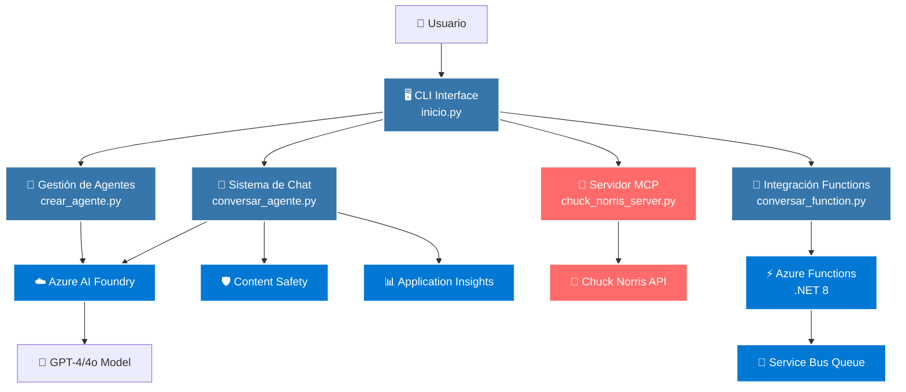

### Arquitectura de Componentes Detallada

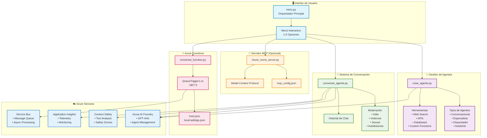

## 🔄 Flujos de Proceso

### Flujo Principal del Sistema

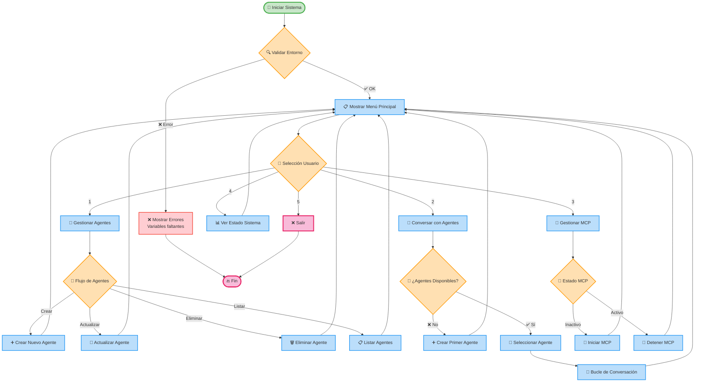

### Flujo de Creación de Agentes

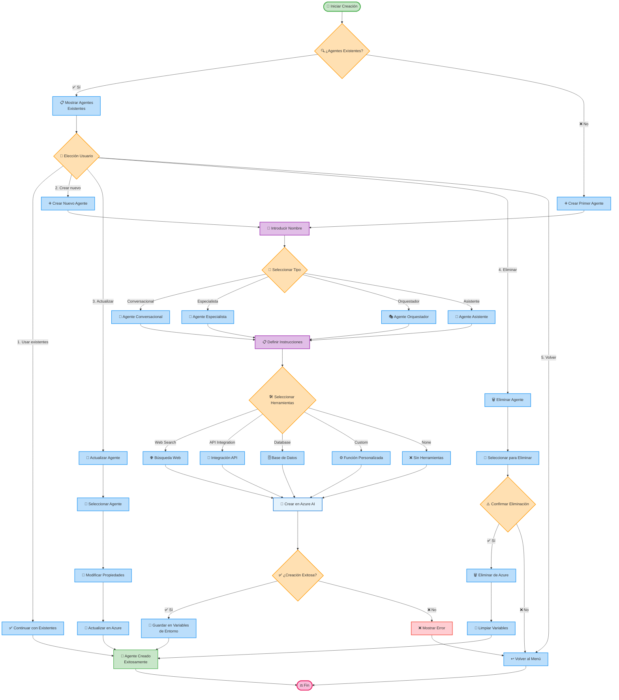

### Flujo de Conversación

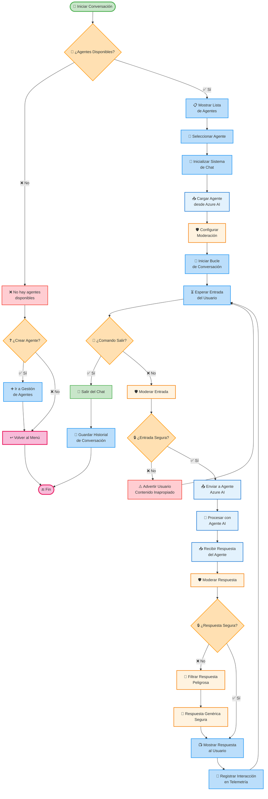

## 📊 Diagramas de Secuencia

### Secuencia de Creación de Agente

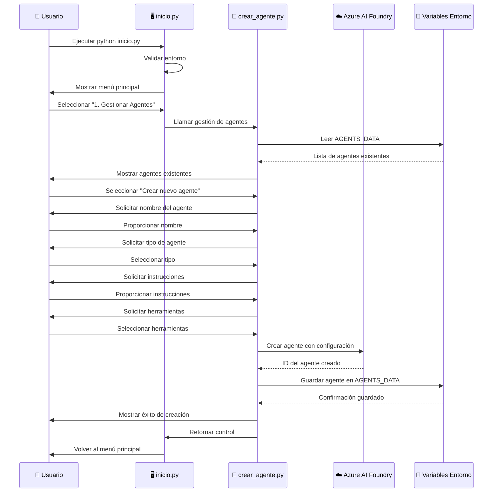

### Secuencia de Conversación con Agente

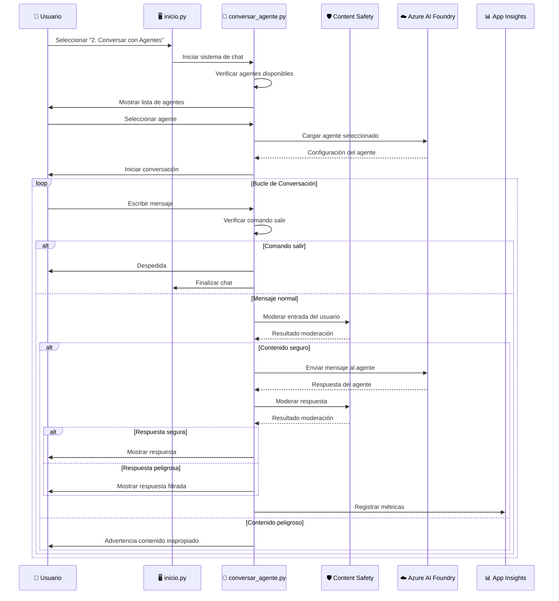

### Secuencia de Servidor MCP

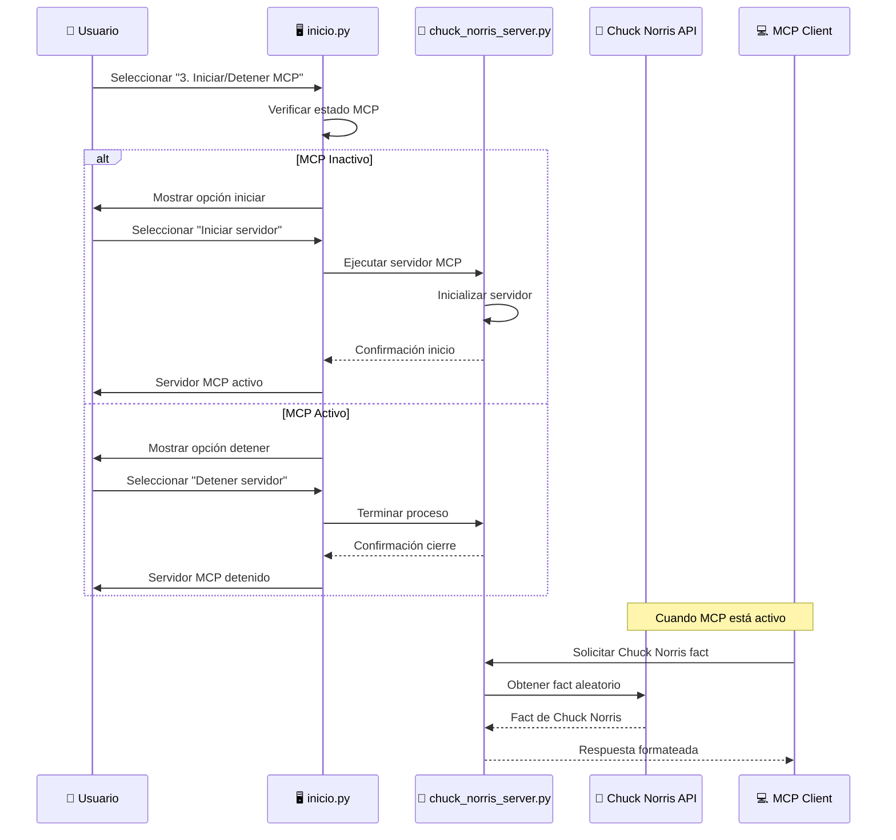

## 🎯 Casos de Uso

### Casos de Uso Principales

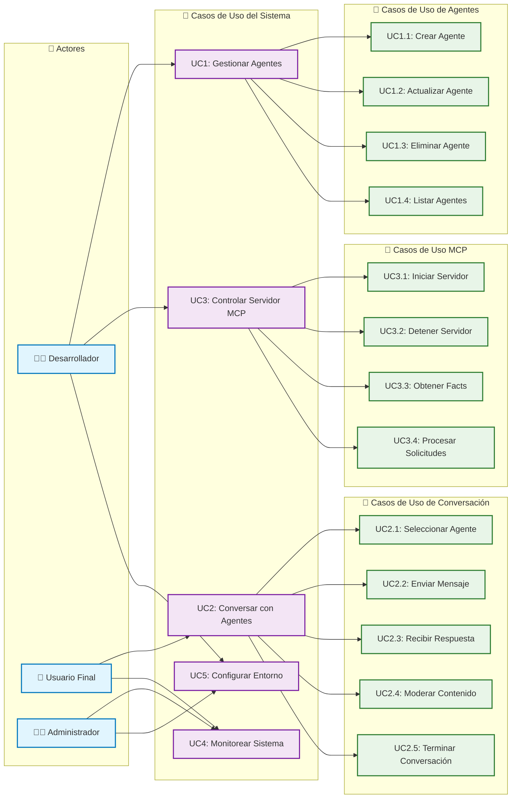

## 🏗️ Diagrama de Clases

### Estructura de Clases Principal

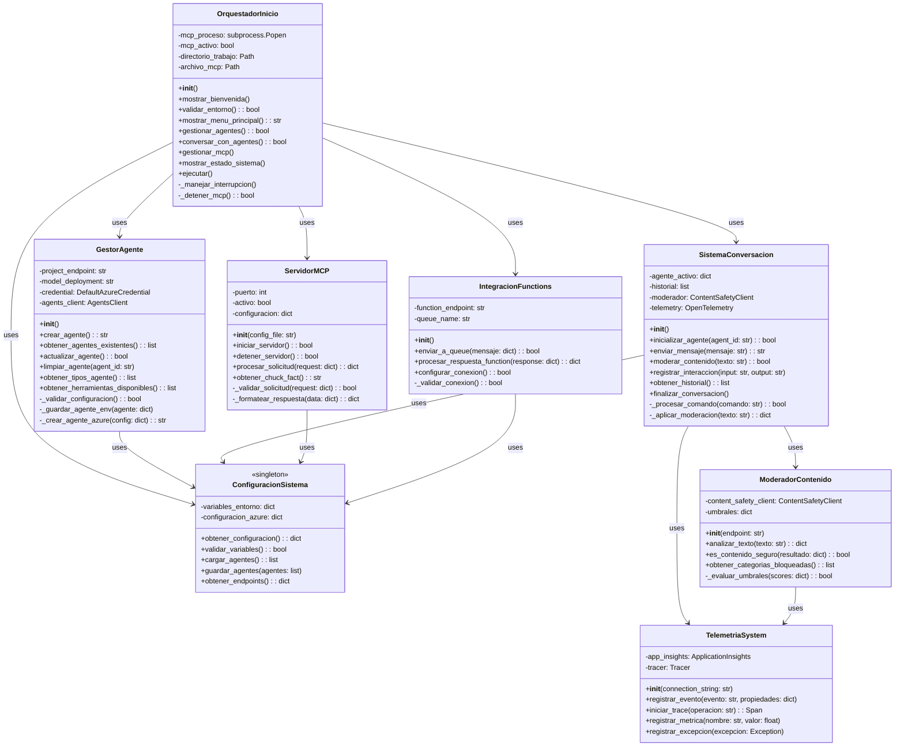

### Modelo de Datos de Agentes

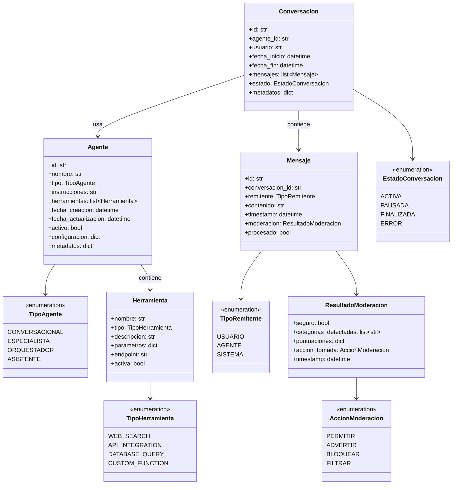

## 📦 Diagrama de Dependencias

### Dependencias del Sistema

```mermaid
flowchart TB
    subgraph "🐍 Aplicación Python"
        App[Sistema de Agentes]
        InicioMod[inicio.py]
        AgentMod[crear_agente.py]
        ChatMod[conversar_agente.py]
        MCPMod[chuck_norris_server.py]
        FuncMod[conversar_function.py]
    end
    
    subgraph "☁️ Azure SDKs"
        AzAgents[azure-ai-agents]
        AzIdentity[azure-identity]
        AzContent[azure-ai-contentsafety]
        AzInference[azure-ai-inference]
        AzMonitor[azure-monitor-opentelemetry]
    end
    
    subgraph "🔌 MCP Dependencies"
        MCPCore[mcp]
        MCPServer[mcp-server]
    end
    
    subgraph "🌐 HTTP & API"
        HTTPX[httpx]
        OpenAI[openai]
        Requests[requests]
    end
    
    subgraph "📊 Observability"
        OpenTelemetry[opentelemetry-api]
        OpenTelemetrySDK[opentelemetry-sdk]
        Logging[logging]
    end
    
    subgraph "⚙️ Configuration"
        DotEnv[python-dotenv]
        JSON[json]
        OS[os]
    end
    
    subgraph "🔧 Utilities"
        Pathlib[pathlib]
        Subprocess[subprocess]
        Signal[signal]
        Time[time]
    end
    
    subgraph "⚡ Azure Functions (.NET)"
        FuncApp[Azure Functions App]
        DotNetRuntime[.NET 8 Runtime]
        ServiceBus[Microsoft.Azure.ServiceBus]
        Extensions[Microsoft.Azure.Functions.Extensions]
    end
    
    App --> InicioMod
    App --> AgentMod
    App --> ChatMod
    App --> MCPMod
    App --> FuncMod
    
    InicioMod --> AzIdentity
    InicioMod --> DotEnv
    InicioMod --> Subprocess
    InicioMod --> Signal
    InicioMod --> Pathlib
    
    AgentMod --> AzAgents
    AgentMod --> AzIdentity
    AgentMod --> JSON
    AgentMod --> OS
    
    ChatMod --> AzAgents
    ChatMod --> AzContent
    ChatMod --> AzInference
    ChatMod --> AzMonitor
    ChatMod --> OpenTelemetry
    ChatMod --> OpenTelemetrySDK
    
    MCPMod --> MCPCore
    MCPMod --> MCPServer
    MCPMod --> HTTPX
    MCPMod --> JSON
    
    FuncMod --> OpenAI
    FuncMod --> HTTPX
    FuncMod --> JSON
    
    FuncApp --> DotNetRuntime
    FuncApp --> ServiceBus
    FuncApp --> Extensions
    
    classDef app fill:#e1f5fe,stroke:#0277bd,stroke-width:2px
    classDef azure fill:#e3f2fd,stroke:#1976d2,stroke-width:2px
    classDef mcp fill:#fff3e0,stroke:#f57c00,stroke-width:2px
    classDef http fill:#e8f5e8,stroke:#2e7d32,stroke-width:2px
    classDef observability fill:#fce4ec,stroke:#c2185b,stroke-width:2px
    classDef config fill:#f3e5f5,stroke:#7b1fa2,stroke-width:2px
    classDef utils fill:#fff8e1,stroke:#f9a825,stroke-width:2px
    classDef dotnet fill:#e8eaf6,stroke:#3f51b5,stroke-width:2px
    
    class App,InicioMod,AgentMod,ChatMod,MCPMod,FuncMod app
    class AzAgents,AzIdentity,AzContent,AzInference,AzMonitor azure
    class MCPCore,MCPServer mcp
    class HTTPX,OpenAI,Requests http
    class OpenTelemetry,OpenTelemetrySDK,Logging observability
    class DotEnv,JSON,OS config
    class Pathlib,Subprocess,Signal,Time utils
    class FuncApp,DotNetRuntime,ServiceBus,Extensions dotnet
```

## 🚀 Diagrama de Despliegue

### Arquitectura de Despliegue en Azure

```mermaid
flowchart TB
    subgraph "🌐 Internet"
        User[👤 Usuario Final]
        Developer[👨‍💻 Desarrollador]
    end
    
    subgraph "💻 Entorno Local"
        LocalEnv[🖥️ Máquina Local]
        PythonEnv[🐍 Entorno Python]
        LocalApp[Sistema de Agentes]
        VSCode[Visual Studio Code]
    end
    
    subgraph "☁️ Microsoft Azure"
        subgraph "🏢 Resource Group"
            subgraph "🤖 Azure AI Services"
                AIFoundry[Azure AI Foundry]
                ContentSafety[Content Safety]
                OpenAIService[Azure OpenAI Service]
            end
            
            subgraph "⚡ Compute Services"
                Functions[Azure Functions<br/>.NET 8]
                AppService[App Service<br/>(Opcional)]
            end
            
            subgraph "💾 Data Services"
                ServiceBus[Service Bus]
                Storage[Storage Account]
                KeyVault[Key Vault]
            end
            
            subgraph "📊 Monitoring"
                AppInsights[Application Insights]
                LogAnalytics[Log Analytics]
                Monitor[Azure Monitor]
            end
        end
    end
    
    subgraph "🔌 External APIs"
        ChuckAPI[🥋 Chuck Norris API]
        WebAPIs[External Web APIs]
    end
    
    User --> LocalApp
    Developer --> VSCode
    VSCode --> LocalApp
    
    LocalApp --> AIFoundry
    LocalApp --> ContentSafety
    LocalApp --> AppInsights
    LocalApp --> Functions
    
    AIFoundry --> OpenAIService
    Functions --> ServiceBus
    Functions --> Storage
    Functions --> KeyVault
    
    LocalApp --> ChuckAPI
    LocalApp --> WebAPIs
    
    AppInsights --> LogAnalytics
    LogAnalytics --> Monitor
    
    classDef user fill:#e1f5fe,stroke:#0277bd,stroke-width:2px
    classDef local fill:#f3e5f5,stroke:#7b1fa2,stroke-width:2px
    classDef azure fill:#e3f2fd,stroke:#1976d2,stroke-width:2px
    classDef ai fill:#e8f5e8,stroke:#2e7d32,stroke-width:2px
    classDef compute fill:#fff3e0,stroke:#f57c00,stroke-width:2px
    classDef data fill:#fce4ec,stroke:#c2185b,stroke-width:2px
    classDef monitoring fill:#fff8e1,stroke:#f9a825,stroke-width:2px
    classDef external fill:#ffebee,stroke:#d32f2f,stroke-width:2px
    
    class User,Developer user
    class LocalEnv,PythonEnv,LocalApp,VSCode local
    class AIFoundry,ContentSafety,OpenAIService ai
    class Functions,AppService compute
    class ServiceBus,Storage,KeyVault data
    class AppInsights,LogAnalytics,Monitor monitoring
    class ChuckAPI,WebAPIs external
```

### Diagrama de Componentes de Despliegue

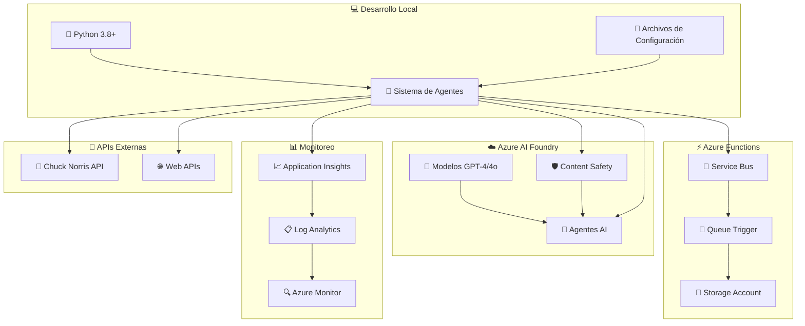

## 🚀 Inicio Rápido

### 1. Configuración del Entorno

```bash
# Clonar o descargar el proyecto
cd agente-aifoundry

# Activar entorno virtual Python (ya incluido)
source bin/activate  # macOS/Linux
# o
.\Scripts\activate   # Windows

# Instalar dependencias (ya instaladas en el entorno)
pip install -r requirements.txt
```

### 2. Configurar Variables de Entorno

Crea un archivo `.env` en la raíz del proyecto:

```bash
# Azure AI Foundry - REQUERIDO
PROJECT_ENDPOINT=https://tu-proyecto.cognitiveservices.azure.com/
MODEL_DEPLOYMENT_NAME=gpt-4

# Azure Content Safety - OPCIONAL (para moderación)
CONTENT_SAFETY_ENDPOINT=https://tu-content-safety.cognitiveservices.azure.com/

# Application Insights - OPCIONAL (para telemetría)
APPLICATION_INSIGHTS_CONNECTION_STRING=InstrumentationKey=xxx;IngestionEndpoint=https://xxx.in.applicationinsights.azure.com/

# Variables del sistema (se configuran automáticamente)
AGENTS_DATA=[]  # Los agentes creados se guardan aquí
```

### 3. Autenticación con Azure

El sistema usa `DefaultAzureCredential`. Configura una opción:

**Opción 1 - Azure CLI (Recomendado para desarrollo):**
```bash
az login
```

**Opción 2 - Variables de entorno:**
```bash
export AZURE_CLIENT_ID="tu-client-id"
export AZURE_CLIENT_SECRET="tu-client-secret" 
export AZURE_TENANT_ID="tu-tenant-id"
```

**Opción 3 - Managed Identity (Para producción en Azure)**

### 4. Ejecutar el Sistema

```bash
python inicio.py
```

## 🎮 Cómo Usar el Sistema

### Menú Principal

Al ejecutar `python inicio.py` verás:

```
🚀 SISTEMA DE AGENTES AZURE AI FOUNDRY
   Estado MCP: 🔴 INACTIVO

1. 🔧 Gestionar Agentes
2. 💬 Conversar con Agentes  
3. 🚀 Iniciar/Detener Servidor MCP
4. 📊 Ver Estado del Sistema
5. ❌ Salir
```

### 1️⃣ Gestionar Agentes

- **Crear agentes**: Define nombre, tipo, instrucciones y herramientas
- **Actualizar agentes**: Modifica agentes existentes
- **Eliminar agentes**: Limpia agentes no deseados
- **Listar agentes**: Ve todos los agentes disponibles

### 2️⃣ Conversar con Agentes

- Selecciona un agente de la lista
- Inicia conversación natural
- El sistema incluye moderación de contenido automática
- Usa `salir`, `quit` o `exit` para terminar

### 3️⃣ Servidor MCP (Opcional)

- **Chuck Norris Facts**: Servidor MCP que provee datos de Chuck Norris
- Solo se inicia si lo seleccionas del menú
- Útil para testing y demostración del protocolo MCP

### 4️⃣ Estado del Sistema

- Ver estado del servidor MCP
- Lista de agentes disponibles
- Configuración de variables de entorno

## ⚡ Azure Functions

El proyecto incluye una **Azure Function en .NET 8** (`funcion/`) con:

### Características
- **Queue Trigger**: Procesa mensajes de Azure Service Bus/Storage Queue
- **Framework**: .NET 8 (LTS)
- **Configuración**: `host.json`, `local.settings.json`

### Desarrollo Local
```bash
# Compilar la función
dotnet build funcion/

# Ejecutar localmente
func start --csharp --source-location funcion/bin/Debug/net8.0
```

### Despliegue
```bash
# Publicar a Azure
func azure functionapp publish tu-function-app --csharp
```

## 📁 Estructura del Proyecto

```
agente-aifoundry/
├── 📄 inicio.py                 # 🎯 Orquestador principal
├── 📄 crear_agente.py           # 🤖 Gestión de agentes
├── 📄 conversar_agente.py       # 💬 Sistema de conversación
├── 📄 chuck_norris_server.py    # 🔌 Servidor MCP opcional
├── 📄 conversar_function.py     # 🔗 Integración con Functions
├── 📄 requirements.txt          # 📦 Dependencias Python
├── 📄 mcp_config.json          # ⚙️ Configuración MCP
├── 📄 .env                     # 🔐 Variables de entorno (crear)
├── 📄 README.md                # 📖 Esta documentación
├── 📂 funcion/                 # ⚡ Azure Functions (.NET 8)
│   ├── funcion.csproj
│   ├── host.json
│   ├── local.settings.json
│   ├── Program.cs
│   └── QueueTrigger1.cs
├── 📂 bin/                     # 🐍 Entorno virtual Python
├── 📂 lib/                     # 📚 Librerías Python
└── 📂 __pycache__/            # 🗂️ Cache Python
```

## 🔧 Configuración Avanzada

### Tipos de Agentes Soportados

El sistema soporta múltiples tipos de agentes:

- **Conversacional**: Chat general y atención al cliente
- **Especialista**: Dominio específico (finanzas, salud, etc.)
- **Orquestador**: Coordina múltiples agentes
- **Asistente**: Tareas específicas y automatización

### Herramientas para Agentes

Los agentes pueden usar herramientas como:

- **Búsqueda web**: Información en tiempo real
- **APIs externas**: Integración con servicios
- **Bases de datos**: Consultas y actualizaciones
- **Funciones personalizadas**: Lógica específica

### Moderación de Contenido

Configuración automática de Azure Content Safety:

```python
# Umbrales de moderación (0-7)
HATE_THRESHOLD = 4      # Contenido de odio
VIOLENCE_THRESHOLD = 4  # Violencia
SEXUAL_THRESHOLD = 4    # Contenido sexual
SELF_HARM_THRESHOLD = 4 # Autolesiones
```

## 🛠️ Desarrollo y Personalización

### Agregar Nuevos Agentes

1. Ejecuta `python crear_agente.py`
2. Selecciona "Crear nuevo agente"
3. Define las características:
   - Nombre único
   - Tipo de agente
   - Instrucciones detalladas
   - Herramientas necesarias

### Personalizar el Sistema

**Modificar inicio.py:**
- Agregar nuevas opciones al menú
- Cambiar validaciones del entorno
- Personalizar mensajes del sistema

**Extender crear_agente.py:**
- Nuevos tipos de agente
- Herramientas personalizadas
- Integraciones adicionales

**Mejorar conversar_agente.py:**
- Nuevos comandos de chat
- Filtros de moderación personalizados
- Exportación de conversaciones

## 🐛 Solución de Problemas

### ❌ Error: Variables de entorno faltantes

```bash
❌ Variables de entorno faltantes:
   - PROJECT_ENDPOINT
   - MODEL_DEPLOYMENT_NAME
```

**Solución:** Configura tu archivo `.env` con los valores correctos de Azure AI Foundry.

### ❌ Error: Autenticación falló

```bash
❌ Error de autenticación con Azure
```

**Solución:** 
1. Ejecuta `az login`
2. Verifica permisos en Azure AI Foundry
3. Confirma que las credenciales tienen acceso al recurso

### ❌ Error: No se pueden crear agentes

```bash
❌ No se pudo crear el agente
```

**Solución:**
1. Verifica que `MODEL_DEPLOYMENT_NAME` sea correcto
2. Confirma que el modelo está desplegado y disponible
3. Revisa logs en Azure Portal

### ❌ Error: Servidor MCP no inicia

```bash
❌ Error al iniciar servidor MCP
```

**Solución:**
1. Verifica que `chuck_norris_server.py` existe
2. Confirma que el puerto no esté en uso
3. Revisa las dependencias de MCP

## 📊 Monitoreo y Observabilidad

### Telemetría Incluida

- **Azure Application Insights**: Métricas de rendimiento
- **OpenTelemetry**: Trazas distribuidas
- **Logs estructurados**: Para debugging
- **Métricas de moderación**: Seguridad de contenido

### Dashboards Disponibles

Si configuras Application Insights:
- Tiempo de respuesta de agentes
- Volumen de conversaciones
- Eventos de moderación
- Errores y excepciones

## 🔐 Seguridad

### Mejores Prácticas Implementadas

- ✅ **Managed Identity**: Autenticación sin credenciales
- ✅ **Content Safety**: Moderación automática
- ✅ **Logs auditables**: Trazabilidad completa
- ✅ **Variables de entorno**: Sin credenciales hardcoded
- ✅ **HTTPS**: Conexiones seguras a APIs
- ✅ **Validación de entrada**: Sanitización de datos

## 🤝 Contribución

1. Fork el proyecto
2. Crea una rama feature (`git checkout -b feature/nueva-funcionalidad`)
3. Commit tus cambios (`git commit -am 'Agregar nueva funcionalidad'`)
4. Push a la rama (`git push origin feature/nueva-funcionalidad`)
5. Abre un Pull Request

## 📄 Licencia

Este proyecto está bajo la Licencia MIT. Ver `LICENSE` para más detalles.

## 🆘 Soporte

- **Documentación**: Este README
- **Issues**: Reporta problemas en GitHub
- **Azure Docs**: [Azure AI Foundry Documentation](https://docs.microsoft.com/azure/ai-foundry/)
- **MCP Protocol**: [Model Context Protocol Specification](https://modelcontextprotocol.io/)

## 🏷️ Tags

`azure-ai` `azure-foundry` `python` `chatbot` `mcp` `azure-functions` `dotnet` `conversational-ai` `content-moderation` `opentelemetry`

---

**🎉 ¡Listo para crear agentes inteligentes con Azure AI Foundry!**

## ⚠️ Limitaciones y Consideraciones Técnicas

### 🚨 Limitaciones Importantes de Azure AI Foundry

Antes de implementar en producción, ten en cuenta estas limitaciones actuales:

#### **🔧 Herramientas y Extensiones**

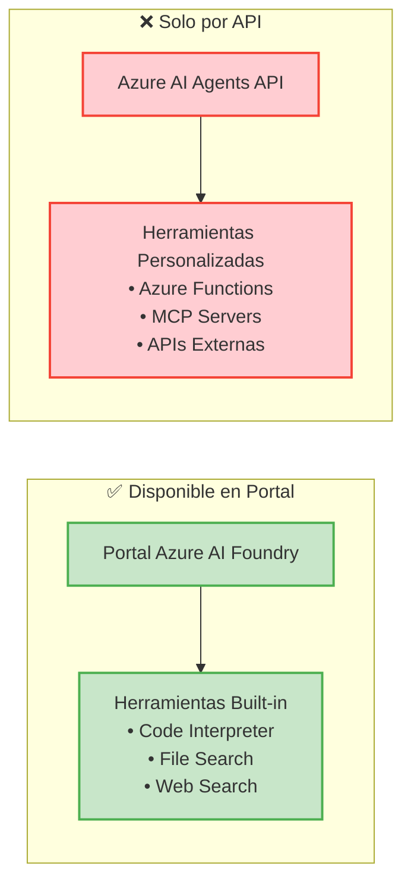

**🚫 Azure Functions y MCP no aparecen en el portal:**
- Las herramientas personalizadas como Azure Functions y servidores MCP **NO** se pueden configurar desde la interfaz web de Azure AI Foundry
- **Solución**: Deben configurarse programáticamente usando la API de Azure AI Agents
- **Impacto**: Mayor complejidad de configuración y debugging

#### **🌍 Disponibilidad Regional del MCP**

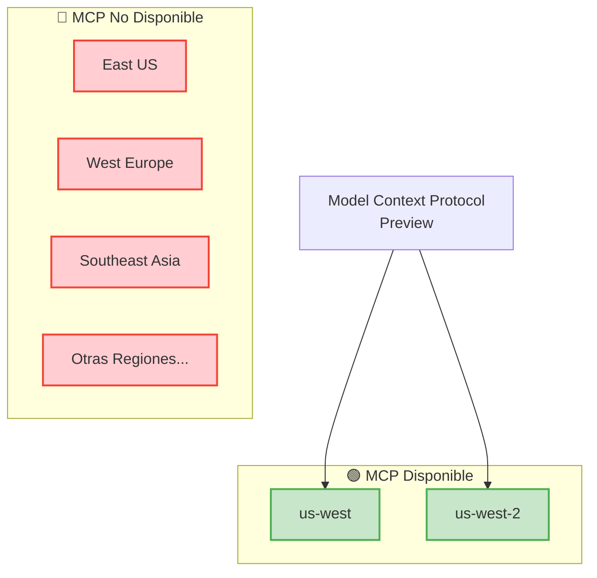

**⚠️ MCP está en Preview limitado:**
- **Solo disponible** en regiones `us-west` y `us-west-2`
- **Estado**: Preview (puede cambiar sin previo aviso)
- **Fecha de commit**: Junio 2025
- **Recomendación**: Verificar disponibilidad regional antes del despliegue

#### **🔗 Orquestación Agent-to-Agent**

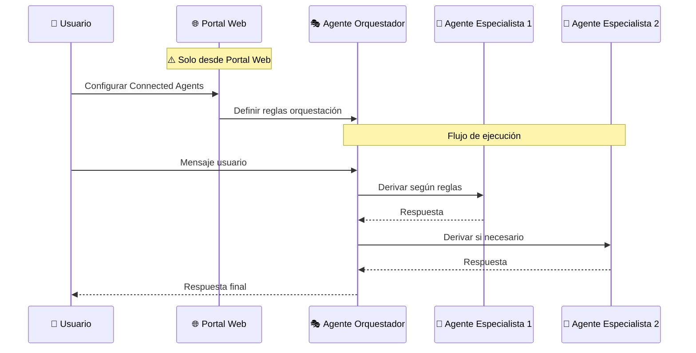

**🚫 Connected Agents solo desde la web:**
- La orquestación **Agent-to-Agent** (Connected Agents) **NO** se puede configurar por API
- **Limitación**: Solo disponible desde la interfaz web de Azure AI Foundry
- **Workaround**: Implementar lógica de orquestación personalizada en el código cliente

#### **📝 Paso de Variables y Contexto**

**❌ Lo que NO funciona:**
```python
# ❌ ESTO NO FUNCIONA - No hay paso directo de variables
agente_orquestador.send_variable("customer_id", "88129215")
agente_ejecutor.receive_variable("customer_id")  # No disponible
```

**✅ Lo que SÍ funciona:**
```python
# ✅ ESTO SÍ FUNCIONA - Contexto conversacional
content = f"[CONTEXT: customer_id={metadata_usuario['customer_id']}] {entrada_usuario}"

mensaje = cliente_agentes.messages.create(
    thread_id=hilo.id, 
    role="user", 
    content=content  # Contexto embebido en el mensaje
)
```

**🔄 Patrón de Contexto Conversacional:**
- **No hay** paso nativo de variables entre UX → Orquestador → Agente Ejecutor
- **Solución**: Embeber contexto en el contenido del mensaje
- **Formato recomendado**: `[CONTEXT: key=value, key2=value2] mensaje_usuario`

### 🛠️ Workarounds y Alternativas

#### **Para Herramientas Personalizadas:**

```python
# Configuración programática de herramientas
herramientas_personalizadas = [
    {
        "type": "function",
        "function": {
            "name": "consultar_azure_function",
            "description": "Consulta una Azure Function para procesamiento",
            "parameters": {
                "type": "object",
                "properties": {
                    "query": {"type": "string"},
                    "customer_id": {"type": "string"}
                }
            }
        }
    }
]

# Crear agente con herramientas por API
agente = cliente_agentes.agents.create(
    model=MODEL_DEPLOYMENT_NAME,
    name="Agente con Functions",
    instructions="Usa Azure Functions cuando sea necesario",
    tools=herramientas_personalizadas  # ⚠️ Solo por API
)
```

#### **Para Orquestación Personalizada:**

```python
def orquestador_personalizado(mensaje_usuario, customer_id):
    """
    Implementa lógica de orquestación personalizada
    como alternativa a Connected Agents
    """
    contexto = f"[CONTEXT: customer_id={customer_id}]"
    
    # Lógica de decisión
    if "consulta_general" in mensaje_usuario.lower():
        return agente_conversacional.process(f"{contexto} {mensaje_usuario}")
    elif "problema_tecnico" in mensaje_usuario.lower():
        return agente_soporte.process(f"{contexto} {mensaje_usuario}")
    else:
        return agente_especialista.process(f"{contexto} {mensaje_usuario}")
```

### 📋 Checklist de Limitaciones

Antes de desplegar en producción, verifica:

- [ ] **Región**: ¿Tu región soporta todas las funcionalidades necesarias?
- [ ] **MCP**: ¿Necesitas MCP? → Usar solo us-west/us-west-2
- [ ] **Herramientas**: ¿Herramientas personalizadas? → Configurar por API
- [ ] **Orquestación**: ¿Multiple agentes? → Portal web o lógica personalizada
- [ ] **Variables**: ¿Contexto entre agentes? → Usar patrón conversacional
- [ ] **Fallbacks**: ¿Alternativas si falla una funcionalidad?

### 🔮 Roadmap y Evolución

**Se espera que Azure AI Foundry evolucione:**
- Soporte API para Connected Agents
- Expansión regional de MCP
- Herramientas personalizadas en portal
- Paso nativo de variables

**Mantente actualizado:**
- [Azure AI Foundry Updates](https://docs.microsoft.com/azure/ai-foundry/whats-new)
- [Azure Roadmap](https://azure.microsoft.com/roadmap/)

