# üöÄ Sistema de Agentes Azure AI Foundry

**Sistema integrado de gestión y conversación con agentes de IA usando Azure AI Foundry, con servidor MCP opcional y Azure Functions**


## 📋 Descripción del Proyecto

Este es un sistema completo para crear, gestionar y conversar con agentes de IA utilizando **Azure AI Foundry**. El proyecto incluye:

- 🤖 **Gestión de agentes**: Crear, actualizar y eliminar agentes de IA
- 💬 **Sistema de conversación**: Interfaz de chat interactiva con moderación de contenido
- üîå **Servidor MCP opcional**: Model Context Protocol para Chuck Norris facts
- ⚡ **Azure Functions**: Función serverless para procesamiento adicional (.NET 8)
- 🎯 **Menú interactivo**: Sistema de navegación fácil de usar

## 🏛️ Arquitectura del Sistema

### Arquitectura de Alto Nivel

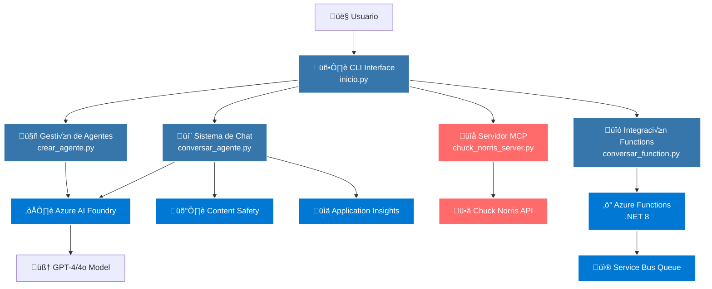
```mermaid
flowchart TB
    User[👤 Usuario] --> CLI["🖥️ CLI Interface
    inicio.py"]
    
    CLI --> AgentMgr["🤖 Gestión de Agentes
    crear_agente.py"]
    CLI --> ChatSys["💬 Sistema de Chat
    conversar_agente.py"]
    CLI --> MCPSrv["üîå Servidor MCP
    chuck_norris_server.py"]
    CLI --> FuncInt["🔗 Integración Functions
    conversar_function.py"]
    
    AgentMgr --> AzAI[☁️ Azure AI Foundry]
    ChatSys --> AzAI
    ChatSys --> ContentSafety[🛡️ Content Safety]
    
    FuncInt --> AzFunc["‚ö° Azure Functions
    .NET 8"]
    AzFunc --> ServiceBus[üì® Service Bus Queue]
    
    MCPSrv --> ChuckAPI[ü•ã Chuck Norris API]
    
    AzAI --> GPT4[🧠 GPT-4/4o Model]
    
    ChatSys --> AppInsights[üìä Application Insights]
    
    classDef azure fill:#0078d4,stroke:#fff,stroke-width:2px,color:#fff
    classDef python fill:#3776ab,stroke:#fff,stroke-width:2px,color:#fff
    classDef optional fill:#ff6b6b,stroke:#fff,stroke-width:2px,color:#fff
    classDef dotnet fill:#512bd4,stroke:#fff,stroke-width:2px,color:#fff
    
    class AzAI,ContentSafety,AzFunc,ServiceBus,AppInsights azure
    class CLI,AgentMgr,ChatSys,FuncInt python
    class MCPSrv,ChuckAPI optional
```

### Arquitectura de Componentes Detallada

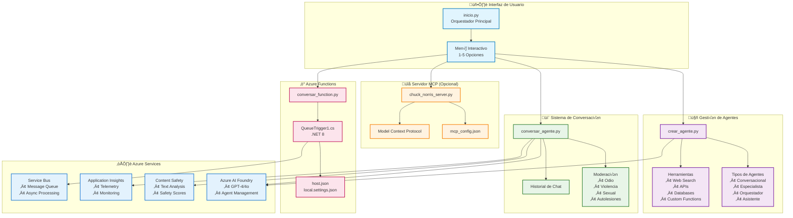
```mermaid
flowchart TB
    subgraph "🖥️ Interfaz de Usuario"
        CLI["inicio.py
        Orquestador Principal"]
        Menu["Men√∫ Interactivo
        1-5 Opciones"]
    end
    
    subgraph "🤖 Gestión de Agentes"
        AgentMgr[crear_agente.py]
        AgentTypes["Tipos de Agentes
        • Conversacional
        • Especialista
        • Orquestador
        • Asistente"]
        AgentTools["Herramientas
        • Web Search
        • APIs
        • Databases
        • Custom Functions"]
    end
    
    subgraph "💬 Sistema de Conversación"
        ChatSys[conversar_agente.py]
        Moderation["Moderación
        • Odio
        • Violencia
        • Sexual
        • Autolesiones"]
        ChatHistory[Historial de Chat]
    end
    
    subgraph "üîå Servidor MCP (Opcional)"
        MCPSrv[chuck_norris_server.py]
        MCPConfig[mcp_config.json]
        MCPProtocol[Model Context Protocol]
    end
    
    subgraph "‚ö° Azure Functions"
        FuncInt[conversar_function.py]
        DotNetFunc["QueueTrigger1.cs
        .NET 8"]
        FuncConfig["host.json
        local.settings.json"]
    end
    
    subgraph "☁️ Azure Services"
        AzAI["Azure AI Foundry
        • GPT-4/4o
        • Agent Management"]
        ContentSafety["Content Safety
        • Text Analysis
        • Safety Scores"]
        AppInsights["Application Insights
        • Telemetry
        • Monitoring"]
        ServiceBus["Service Bus
        • Message Queue
        • Async Processing"]
    end
    
    CLI --> Menu
    Menu --> AgentMgr
    Menu --> ChatSys
    Menu --> MCPSrv
    Menu --> FuncInt
    
    AgentMgr --> AgentTypes
    AgentMgr --> AgentTools
    AgentMgr --> AzAI
    
    ChatSys --> Moderation
    ChatSys --> ChatHistory
    ChatSys --> AzAI
    ChatSys --> ContentSafety
    ChatSys --> AppInsights
    
    MCPSrv --> MCPConfig
    MCPSrv --> MCPProtocol
    
    FuncInt --> DotNetFunc
    DotNetFunc --> FuncConfig
    DotNetFunc --> ServiceBus
    
    classDef interface fill:#e1f5fe,stroke:#0277bd,stroke-width:2px
    classDef management fill:#f3e5f5,stroke:#7b1fa2,stroke-width:2px
    classDef conversation fill:#e8f5e8,stroke:#2e7d32,stroke-width:2px
    classDef mcp fill:#fff3e0,stroke:#f57c00,stroke-width:2px
    classDef functions fill:#fce4ec,stroke:#c2185b,stroke-width:2px
    classDef azure fill:#e3f2fd,stroke:#1976d2,stroke-width:2px
    
    class CLI,Menu interface
    class AgentMgr,AgentTypes,AgentTools management
    class ChatSys,Moderation,ChatHistory conversation
    class MCPSrv,MCPConfig,MCPProtocol mcp
    class FuncInt,DotNetFunc,FuncConfig functions
    class AzAI,ContentSafety,AppInsights,ServiceBus azure
```

## 🔄 Flujos de Proceso

### Flujo Principal del Sistema

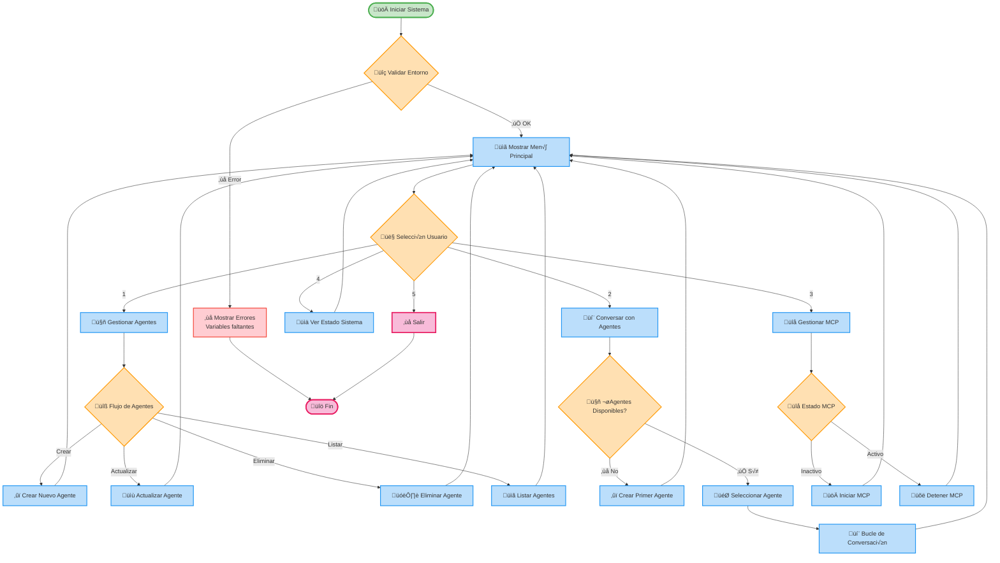
```mermaid
flowchart TD
    Start([üöÄ Iniciar Sistema]) --> ValidateEnv{üîç Validar Entorno}
    ValidateEnv -->|‚ùå Error| ShowError["‚ùå Mostrar Errores
    Variables faltantes"]
    ValidateEnv -->|‚úÖ OK| ShowMenu[üìã Mostrar Men√∫ Principal]
    
    ShowMenu --> MenuChoice{👤 Selección Usuario}
    
    MenuChoice -->|1| ManageAgents[🤖 Gestionar Agentes]
    MenuChoice -->|2| StartChat[💬 Conversar con Agentes]
    MenuChoice -->|3| ManageMCP[üîå Gestionar MCP]
    MenuChoice -->|4| ShowStatus[üìä Ver Estado Sistema]
    MenuChoice -->|5| Exit[‚ùå Salir]
    
    ManageAgents --> AgentFlow{üîß Flujo de Agentes}
    AgentFlow -->|Crear| CreateAgent[‚ûï Crear Nuevo Agente]
    AgentFlow -->|Actualizar| UpdateAgent[üìù Actualizar Agente]
    AgentFlow -->|Eliminar| DeleteAgent[🗑️ Eliminar Agente]
    AgentFlow -->|Listar| ListAgents[üìã Listar Agentes]
    
    StartChat --> CheckAgents{🤖 ¿Agentes Disponibles?}
    CheckAgents -->|‚ùå No| CreateFirst[‚ûï Crear Primer Agente]
    CheckAgents -->|✅ Sí| SelectAgent[🎯 Seleccionar Agente]
    SelectAgent --> ChatLoop[💬 Bucle de Conversación]
    
    ManageMCP --> MCPChoice{üîå Estado MCP}
    MCPChoice -->|Inactivo| StartMCP[üöÄ Iniciar MCP]
    MCPChoice -->|Activo| StopMCP[üõë Detener MCP]
    
    CreateAgent --> ShowMenu
    UpdateAgent --> ShowMenu
    DeleteAgent --> ShowMenu
    ListAgents --> ShowMenu
    CreateFirst --> ShowMenu
    ChatLoop --> ShowMenu
    StartMCP --> ShowMenu
    StopMCP --> ShowMenu
    ShowStatus --> ShowMenu
    ShowError --> EndFlow([üîö Fin])
    Exit --> EndFlow
    
    classDef startNode fill:#c8e6c9,stroke:#4caf50,stroke-width:3px
    classDef processNode fill:#bbdefb,stroke:#2196f3,stroke-width:2px
    classDef decisionNode fill:#ffe0b2,stroke:#ff9800,stroke-width:2px
    classDef errorNode fill:#ffcdd2,stroke:#f44336,stroke-width:2px
    classDef endNode fill:#f8bbd9,stroke:#e91e63,stroke-width:3px
    
    class Start startNode
    class ShowMenu,ManageAgents,StartChat,ManageMCP,ShowStatus,CreateAgent,UpdateAgent,DeleteAgent,ListAgents,SelectAgent,ChatLoop,StartMCP,StopMCP,CreateFirst processNode
    class ValidateEnv,MenuChoice,AgentFlow,CheckAgents,MCPChoice decisionNode
    class ShowError errorNode
    class Exit,EndFlow endNode
```

### Flujo de Creación de Agentes

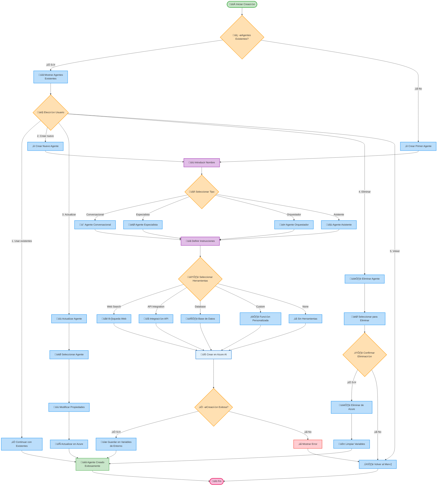
```mermaid
flowchart TD
    Start([🚀 Iniciar Creación]) --> CheckExisting{🔍 ¿Agentes Existentes?}
    
    CheckExisting -->|✅ Sí| ShowExisting["📋 Mostrar Agentes
    Existentes"]
    CheckExisting -->|‚ùå No| DirectCreate[‚ûï Crear Primer Agente]
    
    ShowExisting --> UserChoice{👤 Elección Usuario}
    UserChoice -->|1. Usar existentes| UseExisting[‚úÖ Continuar con Existentes]
    UserChoice -->|2. Crear nuevo| CreateNew[‚ûï Crear Nuevo Agente]
    UserChoice -->|3. Actualizar| UpdateExisting[üìù Actualizar Agente]
    UserChoice -->|4. Eliminar| DeleteExisting[🗑️ Eliminar Agente]
    UserChoice -->|5. Volver| Return[↩️ Volver al Menú]
    
    CreateNew --> InputName[üìù Introducir Nombre]
    DirectCreate --> InputName
    
    InputName --> SelectType{🤖 Seleccionar Tipo}
    SelectType -->|Conversacional| ConvType[💬 Agente Conversacional]
    SelectType -->|Especialista| SpecType[🎯 Agente Especialista]
    SelectType -->|Orquestador| OrchType[üé≠ Agente Orquestador]
    SelectType -->|Asistente| AssistType[🤝 Agente Asistente]
    
    ConvType --> InputInstructions[üìã Definir Instrucciones]
    SpecType --> InputInstructions
    OrchType --> InputInstructions
    AssistType --> InputInstructions
    
    InputInstructions --> SelectTools{🛠️ Seleccionar Herramientas}
    SelectTools -->|Web Search| WebTool[üåê B√∫squeda Web]
    SelectTools -->|API Integration| APITool[🔌 Integración API]
    SelectTools -->|Database| DBTool[🗄️ Base de Datos]
    SelectTools -->|Custom| CustomTool[⚙️ Función Personalizada]
    SelectTools -->|None| NoTools[‚ùå Sin Herramientas]
    
    WebTool --> CreateAgent[üîß Crear en Azure AI]
    APITool --> CreateAgent
    DBTool --> CreateAgent
    CustomTool --> CreateAgent
    NoTools --> CreateAgent
    
    CreateAgent --> ValidateCreation{✅ ¿Creación Exitosa?}
    ValidateCreation -->|✅ Sí| SaveAgent["💾 Guardar en Variables
    de Entorno"]
    ValidateCreation -->|‚ùå No| ShowError[‚ùå Mostrar Error]
    
    SaveAgent --> Success["üéâ Agente Creado
    Exitosamente"]
    
    UpdateExisting --> SelectExisting[🎯 Seleccionar Agente]
    SelectExisting --> ModifyAgent[üìù Modificar Propiedades]
    ModifyAgent --> UpdateAgent[🔄 Actualizar en Azure]
    UpdateAgent --> Success
    
    DeleteExisting --> SelectToDelete[🎯 Seleccionar para Eliminar]
    SelectToDelete --> ConfirmDelete{⚠️ Confirmar Eliminación}
    ConfirmDelete -->|✅ Sí| DeleteAgent[🗑️ Eliminar de Azure]
    ConfirmDelete -->|‚ùå No| Return
    DeleteAgent --> CleanupVars[üßπ Limpiar Variables]
    CleanupVars --> Success
    
    UseExisting --> Success
    ShowError --> Return
    Success --> EndFlow([üîö Fin])
    Return --> EndFlow
    
    classDef startNode fill:#c8e6c9,stroke:#4caf50,stroke-width:3px
    classDef processNode fill:#bbdefb,stroke:#2196f3,stroke-width:2px
    classDef decisionNode fill:#ffe0b2,stroke:#ff9800,stroke-width:2px
    classDef inputNode fill:#e1bee7,stroke:#9c27b0,stroke-width:2px
    classDef azureNode fill:#e3f2fd,stroke:#1976d2,stroke-width:2px
    classDef successNode fill:#c8e6c9,stroke:#4caf50,stroke-width:2px
    classDef errorNode fill:#ffcdd2,stroke:#f44336,stroke-width:2px
    classDef endNode fill:#f8bbd9,stroke:#e91e63,stroke-width:3px
    
    class Start startNode
    class ShowExisting,DirectCreate,UseExisting,CreateNew,UpdateExisting,DeleteExisting,ConvType,SpecType,OrchType,AssistType,WebTool,APITool,DBTool,CustomTool,NoTools,SaveAgent,SelectExisting,ModifyAgent,UpdateAgent,SelectToDelete,DeleteAgent,CleanupVars,Return processNode
    class CheckExisting,UserChoice,SelectType,SelectTools,ValidateCreation,ConfirmDelete decisionNode
    class InputName,InputInstructions inputNode
    class CreateAgent azureNode
    class Success successNode
    class ShowError errorNode
    class EndFlow endNode
```

### Flujo de Conversación

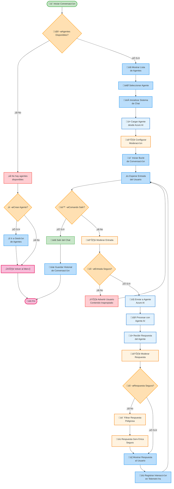
```mermaid
flowchart TD
    Start([💬 Iniciar Conversación]) --> CheckAgents{🤖 ¿Agentes Disponibles?}
    
    CheckAgents -->|‚ùå No| NoAgents["‚ùå No hay agentes
    disponibles"]
    CheckAgents -->|✅ Sí| ShowAgents["📋 Mostrar Lista
    de Agentes"]
    
    NoAgents --> OfferCreate{‚ùì ¬øCrear Agente?}
    OfferCreate -->|✅ Sí| CreateAgent["➕ Ir a Gestión
    de Agentes"]
    OfferCreate -->|❌ No| Return[↩️ Volver al Menú]
    
    ShowAgents --> SelectAgent[🎯 Seleccionar Agente]
    SelectAgent --> InitializeChat["üöÄ Inicializar Sistema
    de Chat"]
    
    InitializeChat --> LoadAgent["üì• Cargar Agente
    desde Azure AI"]
    LoadAgent --> SetupModeration["🛡️ Configurar
    Moderación"]
    SetupModeration --> StartChatLoop["💬 Iniciar Bucle
    de Conversación"]
    
    StartChatLoop --> WaitInput["‚è≥ Esperar Entrada
    del Usuario"]
    WaitInput --> CheckExit{üö™ ¬øComando Salir?}
    
    CheckExit -->|✅ Sí| ExitChat[👋 Salir del Chat]
    CheckExit -->|❌ No| ModerateInput[🛡️ Moderar Entrada]
    
    ModerateInput --> InputSafe{üîí ¬øEntrada Segura?}
    InputSafe -->|❌ No| WarnUser["⚠️ Advertir Usuario
    Contenido Inapropiado"]
    InputSafe -->|✅ Sí| SendToAgent["📤 Enviar a Agente
    Azure AI"]
    
    WarnUser --> WaitInput
    
    SendToAgent --> AgentProcess["🤖 Procesar con
    Agente AI"]
    AgentProcess --> ReceiveResponse["üì• Recibir Respuesta
    del Agente"]
    
    ReceiveResponse --> ModerateResponse[🛡️ Moderar Respuesta]
    ModerateResponse --> ResponseSafe{üîí ¬øRespuesta Segura?}
    
    ResponseSafe -->|‚ùå No| FilterResponse["üö´ Filtrar Respuesta
    Peligrosa"]
    ResponseSafe -->|✅ Sí| DisplayResponse["📺 Mostrar Respuesta
    al Usuario"]
    
    FilterResponse --> GenericResponse["📝 Respuesta Genérica
    Segura"]
    GenericResponse --> DisplayResponse
    
    DisplayResponse --> LogInteraction["📝 Registrar Interacción
    en Telemetría"]
    LogInteraction --> WaitInput
    
    CreateAgent --> Return
    ExitChat --> SaveHistory["üíæ Guardar Historial
    de Conversación"]
    SaveHistory --> EndFlow([üîö Fin])
    Return --> EndFlow
    
    classDef startNode fill:#c8e6c9,stroke:#4caf50,stroke-width:3px
    classDef processNode fill:#bbdefb,stroke:#2196f3,stroke-width:2px
    classDef decisionNode fill:#ffe0b2,stroke:#ff9800,stroke-width:2px
    classDef securityNode fill:#fff3e0,stroke:#f57c00,stroke-width:2px
    classDef azureNode fill:#e3f2fd,stroke:#1976d2,stroke-width:2px
    classDef errorNode fill:#ffcdd2,stroke:#f44336,stroke-width:2px
    classDef successNode fill:#c8e6c9,stroke:#4caf50,stroke-width:2px
    classDef endNode fill:#f8bbd9,stroke:#e91e63,stroke-width:3px
    
    class Start startNode
    class ShowAgents,SelectAgent,InitializeChat,LoadAgent,StartChatLoop,WaitInput,SendToAgent,AgentProcess,ReceiveResponse,DisplayResponse,LogInteraction,CreateAgent,SaveHistory processNode
    class CheckAgents,OfferCreate,CheckExit,InputSafe,ResponseSafe decisionNode
    class SetupModeration,ModerateInput,ModerateResponse,FilterResponse,GenericResponse securityNode
    class LoadAgent,SendToAgent,AgentProcess,ReceiveResponse azureNode
    class NoAgents,WarnUser errorNode
    class ExitChat successNode
    class Return,EndFlow endNode
```

## üìä Diagramas de Secuencia

### Secuencia de Creación de Agente

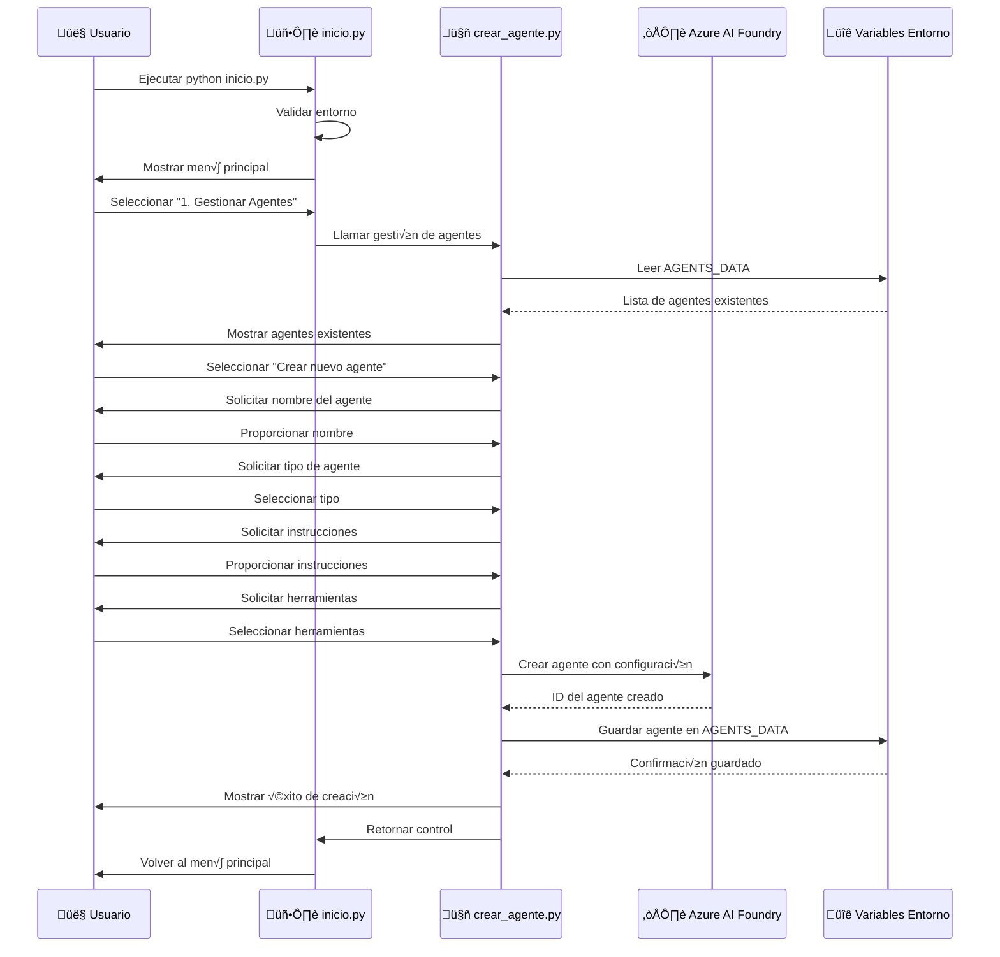
```mermaid
sequenceDiagram
    participant U as 👤 Usuario
    participant CLI as 🖥️ inicio.py
    participant AM as 🤖 crear_agente.py
    participant AZ as ☁️ Azure AI Foundry
    participant ENV as üîê Variables Entorno
    
    U->>CLI: Ejecutar python inicio.py
    CLI->>CLI: Validar entorno
    CLI->>U: Mostrar men√∫ principal
    U->>CLI: Seleccionar "1. Gestionar Agentes"
    CLI->>AM: Llamar gestión de agentes
    
    AM->>ENV: Leer AGENTS_DATA
    ENV-->>AM: Lista de agentes existentes
    AM->>U: Mostrar agentes existentes
    U->>AM: Seleccionar "Crear nuevo agente"
    
    AM->>U: Solicitar nombre del agente
    U->>AM: Proporcionar nombre
    AM->>U: Solicitar tipo de agente
    U->>AM: Seleccionar tipo
    AM->>U: Solicitar instrucciones
    U->>AM: Proporcionar instrucciones
    AM->>U: Solicitar herramientas
    U->>AM: Seleccionar herramientas
    
    AM->>AZ: Crear agente con configuración
    AZ-->>AM: ID del agente creado
    AM->>ENV: Guardar agente en AGENTS_DATA
    ENV-->>AM: Confirmación guardado
    
    AM->>U: Mostrar éxito de creación
    AM->>CLI: Retornar control
    CLI->>U: Volver al men√∫ principal
```

### Secuencia de Conversación con Agente

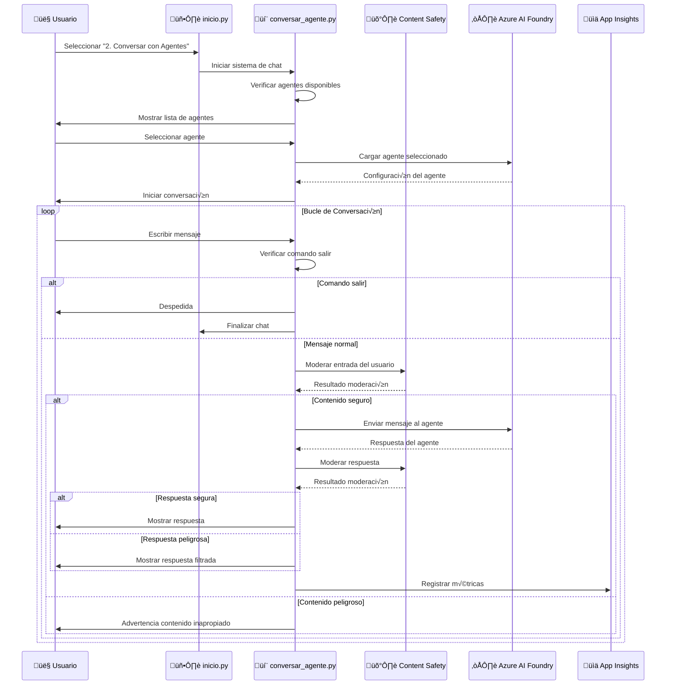
```mermaid
sequenceDiagram
    participant U as 👤 Usuario
    participant CLI as 🖥️ inicio.py
    participant CHAT as 💬 conversar_agente.py
    participant MOD as 🛡️ Content Safety
    participant AZ as ☁️ Azure AI Foundry
    participant INS as üìä App Insights
    
    U->>CLI: Seleccionar "2. Conversar con Agentes"
    CLI->>CHAT: Iniciar sistema de chat
    CHAT->>CHAT: Verificar agentes disponibles
    CHAT->>U: Mostrar lista de agentes
    U->>CHAT: Seleccionar agente
    
    CHAT->>AZ: Cargar agente seleccionado
    AZ-->>CHAT: Configuración del agente
    CHAT->>U: Iniciar conversación
    
    loop Bucle de Conversación
        U->>CHAT: Escribir mensaje
        CHAT->>CHAT: Verificar comando salir
        
        alt Comando salir
            CHAT->>U: Despedida
            CHAT->>CLI: Finalizar chat
        else Mensaje normal
            CHAT->>MOD: Moderar entrada del usuario
            MOD-->>CHAT: Resultado moderación
            
            alt Contenido seguro
                CHAT->>AZ: Enviar mensaje al agente
                AZ-->>CHAT: Respuesta del agente
                CHAT->>MOD: Moderar respuesta
                MOD-->>CHAT: Resultado moderación
                
                alt Respuesta segura
                    CHAT->>U: Mostrar respuesta
                else Respuesta peligrosa
                    CHAT->>U: Mostrar respuesta filtrada
                end
                
                CHAT->>INS: Registrar métricas
            else Contenido peligroso
                CHAT->>U: Advertencia contenido inapropiado
            end
        end
    end
```

### Secuencia de Servidor MCP

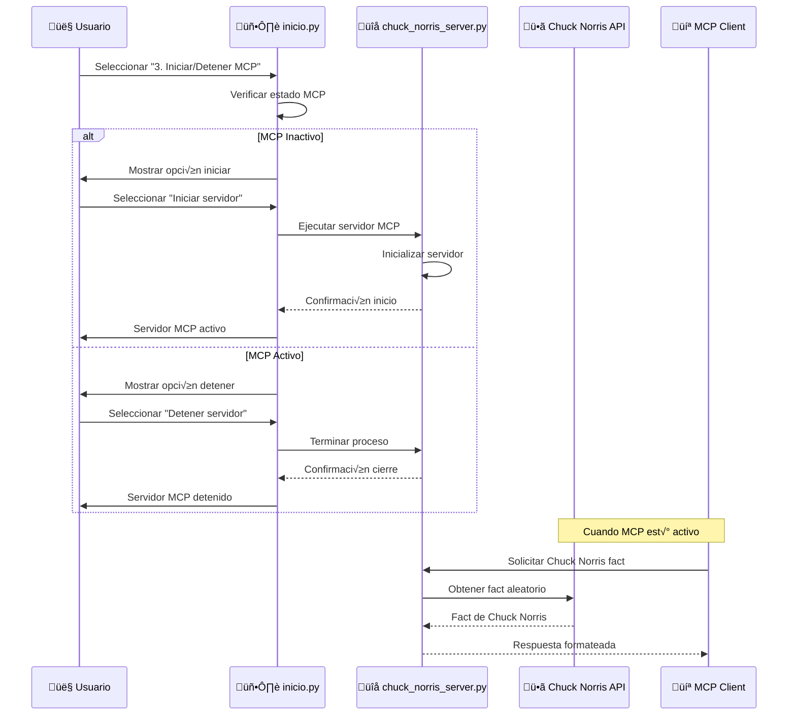
```mermaid
sequenceDiagram
    participant U as 👤 Usuario
    participant CLI as 🖥️ inicio.py
    participant MCP as üîå chuck_norris_server.py
    participant API as ü•ã Chuck Norris API
    participant CLIENT as 💻 MCP Client
    
    U->>CLI: Seleccionar "3. Iniciar/Detener MCP"
    CLI->>CLI: Verificar estado MCP
    
    alt MCP Inactivo
        CLI->>U: Mostrar opción iniciar
        U->>CLI: Seleccionar "Iniciar servidor"
        CLI->>MCP: Ejecutar servidor MCP
        MCP->>MCP: Inicializar servidor
        MCP-->>CLI: Confirmación inicio
        CLI->>U: Servidor MCP activo
    else MCP Activo
        CLI->>U: Mostrar opción detener
        U->>CLI: Seleccionar "Detener servidor"
        CLI->>MCP: Terminar proceso
        MCP-->>CLI: Confirmación cierre
        CLI->>U: Servidor MCP detenido
    end
    
    note over CLIENT,API: Cuando MCP est√° activo
    CLIENT->>MCP: Solicitar Chuck Norris fact
    MCP->>API: Obtener fact aleatorio
    API-->>MCP: Fact de Chuck Norris
    MCP-->>CLIENT: Respuesta formateada
```

## 🎯 Casos de Uso

### Casos de Uso Principales

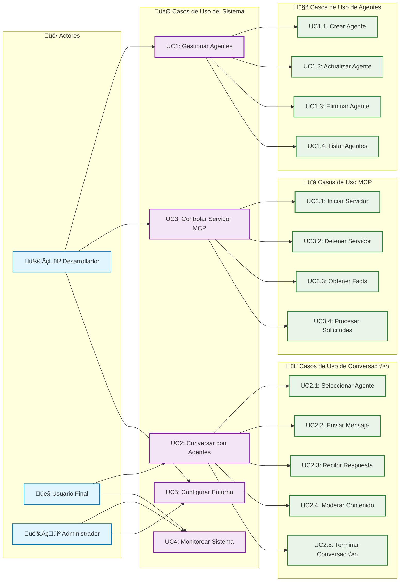
```mermaid
flowchart LR
    subgraph "üë• Actores"
        DEV[👨‍💻 Desarrollador]
        USER[👤 Usuario Final]
        ADMIN[👨‍💼 Administrador]
    end
    
    subgraph "🎯 Casos de Uso del Sistema"
        UC1[UC1: Gestionar Agentes]
        UC2[UC2: Conversar con Agentes]
        UC3[UC3: Controlar Servidor MCP]
        UC4[UC4: Monitorear Sistema]
        UC5[UC5: Configurar Entorno]
    end
    
    subgraph "🤖 Casos de Uso de Agentes"
        UC1_1[UC1.1: Crear Agente]
        UC1_2[UC1.2: Actualizar Agente]
        UC1_3[UC1.3: Eliminar Agente]
        UC1_4[UC1.4: Listar Agentes]
    end
    
    subgraph "💬 Casos de Uso de Conversación"
        UC2_1[UC2.1: Seleccionar Agente]
        UC2_2[UC2.2: Enviar Mensaje]
        UC2_3[UC2.3: Recibir Respuesta]
        UC2_4[UC2.4: Moderar Contenido]
        UC2_5[UC2.5: Terminar Conversación]
    end
    
    subgraph "üîå Casos de Uso MCP"
        UC3_1[UC3.1: Iniciar Servidor]
        UC3_2[UC3.2: Detener Servidor]
        UC3_3[UC3.3: Obtener Facts]
        UC3_4[UC3.4: Procesar Solicitudes]
    end
    
    DEV --> UC1
    DEV --> UC3
    DEV --> UC5
    
    USER --> UC2
    USER --> UC4
    
    ADMIN --> UC4
    ADMIN --> UC5
    
    UC1 --> UC1_1
    UC1 --> UC1_2
    UC1 --> UC1_3
    UC1 --> UC1_4
    
    UC2 --> UC2_1
    UC2 --> UC2_2
    UC2 --> UC2_3
    UC2 --> UC2_4
    UC2 --> UC2_5
    
    UC3 --> UC3_1
    UC3 --> UC3_2
    UC3 --> UC3_3
    UC3 --> UC3_4
    
    classDef actor fill:#e1f5fe,stroke:#0277bd,stroke-width:2px
    classDef usecase fill:#f3e5f5,stroke:#7b1fa2,stroke-width:2px
    classDef detailed fill:#e8f5e8,stroke:#2e7d32,stroke-width:2px
    
    class DEV,USER,ADMIN actor
    class UC1,UC2,UC3,UC4,UC5 usecase
    class UC1_1,UC1_2,UC1_3,UC1_4,UC2_1,UC2_2,UC2_3,UC2_4,UC2_5,UC3_1,UC3_2,UC3_3,UC3_4 detailed
```

## 🏗️ Diagrama de Clases

### Estructura de Clases Principal

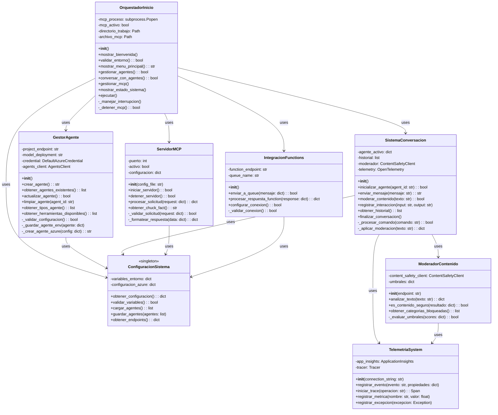
```mermaid
classDiagram
    class OrquestadorInicio {
        -mcp_proceso: subprocess.Popen
        -mcp_activo: bool
        -directorio_trabajo: Path
        -archivo_mcp: Path
        +__init__()
        +mostrar_bienvenida()
        +validar_entorno(): bool
        +mostrar_menu_principal(): str
        +gestionar_agentes(): bool
        +conversar_con_agentes(): bool
        +gestionar_mcp()
        +mostrar_estado_sistema()
        +ejecutar()
        -_manejar_interrupcion()
        -_detener_mcp(): bool
    }
    
    class GestorAgente {
        -project_endpoint: str
        -model_deployment: str
        -credential: DefaultAzureCredential
        -agents_client: AgentsClient
        +__init__()
        +crear_agente(): str
        +obtener_agentes_existentes(): list
        +actualizar_agente(): bool
        +limpiar_agente(agent_id: str)
        +obtener_tipos_agente(): list
        +obtener_herramientas_disponibles(): list
        -_validar_configuracion(): bool
        -_guardar_agente_env(agente: dict)
        -_crear_agente_azure(config: dict): str
    }
    
    class SistemaConversacion {
        -agente_activo: dict
        -historial: list
        -moderador: ContentSafetyClient
        -telemetry: OpenTelemetry
        +__init__()
        +inicializar_agente(agent_id: str): bool
        +enviar_mensaje(mensaje: str): str
        +moderar_contenido(texto: str): bool
        +registrar_interaccion(input: str, output: str)
        +obtener_historial(): list
        +finalizar_conversacion()
        -_procesar_comando(comando: str): bool
        -_aplicar_moderacion(texto: str): dict
    }
    
    class ServidorMCP {
        -puerto: int
        -activo: bool
        -configuracion: dict
        +__init__(config_file: str)
        +iniciar_servidor(): bool
        +detener_servidor(): bool
        +procesar_solicitud(request: dict): dict
        +obtener_chuck_fact(): str
        -_validar_solicitud(request: dict): bool
        -_formatear_respuesta(data: dict): dict
    }
    
    class IntegracionFunctions {
        -function_endpoint: str
        -queue_name: str
        +__init__()
        +enviar_a_queue(mensaje: dict): bool
        +procesar_respuesta_function(response: dict): dict
        +configurar_conexion(): bool
        -_validar_conexion(): bool
    }
    
    class ConfiguracionSistema {
        <<singleton>>
        -variables_entorno: dict
        -configuracion_azure: dict
        +obtener_configuracion(): dict
        +validar_variables(): bool
        +cargar_agentes(): list
        +guardar_agentes(agentes: list)
        +obtener_endpoints(): dict
    }
    
    class ModeradorContenido {
        -content_safety_client: ContentSafetyClient
        -umbrales: dict
        +__init__(endpoint: str)
        +analizar_texto(texto: str): dict
        +es_contenido_seguro(resultado: dict): bool
        +obtener_categorias_bloqueadas(): list
        -_evaluar_umbrales(scores: dict): bool
    }
    
    class TelemetriaSystem {
        -app_insights: ApplicationInsights
        -tracer: Tracer
        +__init__(connection_string: str)
        +registrar_evento(evento: str, propiedades: dict)
        +iniciar_trace(operacion: str): Span
        +registrar_metrica(nombre: str, valor: float)
        +registrar_excepcion(excepcion: Exception)
    }
    
    OrquestadorInicio --> GestorAgente : uses
    OrquestadorInicio --> SistemaConversacion : uses
    OrquestadorInicio --> ServidorMCP : uses
    OrquestadorInicio --> IntegracionFunctions : uses
    OrquestadorInicio --> ConfiguracionSistema : uses
    
    GestorAgente --> ConfiguracionSistema : uses
    SistemaConversacion --> ModeradorContenido : uses
    SistemaConversacion --> TelemetriaSystem : uses
    SistemaConversacion --> ConfiguracionSistema : uses
    
    ServidorMCP --> ConfiguracionSistema : uses
    IntegracionFunctions --> ConfiguracionSistema : uses
    
    ModeradorContenido --> TelemetriaSystem : uses
```

### Modelo de Datos de Agentes

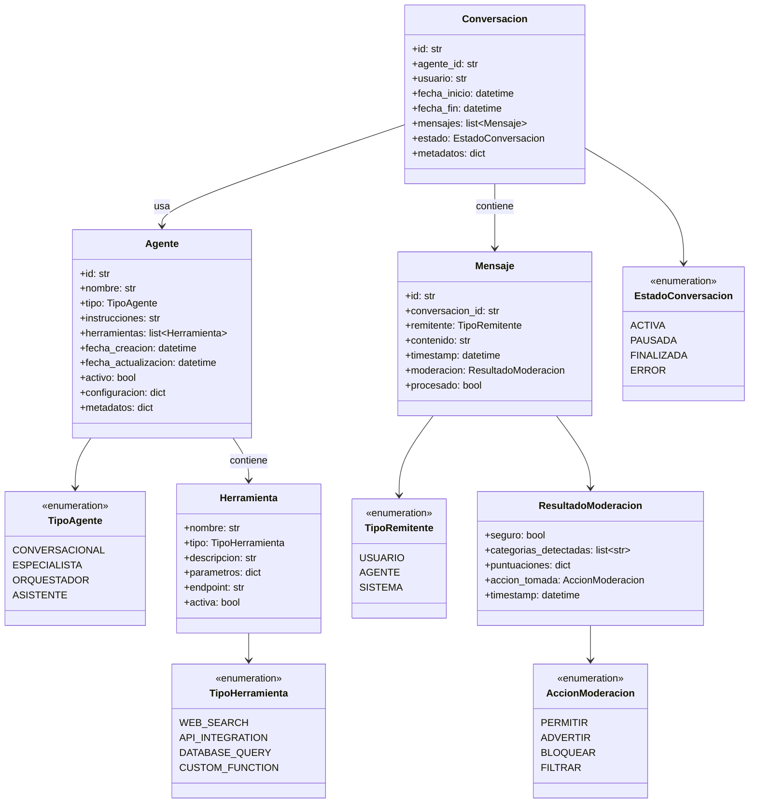
```mermaid
classDiagram
    class Agente {
        +id: str
        +nombre: str
        +tipo: TipoAgente
        +instrucciones: str
        +herramientas: list~Herramienta~
        +fecha_creacion: datetime
        +fecha_actualizacion: datetime
        +activo: bool
        +configuracion: dict
        +metadatos: dict
    }
    
    class TipoAgente {
        <<enumeration>>
        CONVERSACIONAL
        ESPECIALISTA
        ORQUESTADOR
        ASISTENTE
    }
    
    class Herramienta {
        +nombre: str
        +tipo: TipoHerramienta
        +descripcion: str
        +parametros: dict
        +endpoint: str
        +activa: bool
    }
    
    class TipoHerramienta {
        <<enumeration>>
        WEB_SEARCH
        API_INTEGRATION
        DATABASE_QUERY
        CUSTOM_FUNCTION
    }
    
    class Conversacion {
        +id: str
        +agente_id: str
        +usuario: str
        +fecha_inicio: datetime
        +fecha_fin: datetime
        +mensajes: list~Mensaje~
        +estado: EstadoConversacion
        +metadatos: dict
    }
    
    class Mensaje {
        +id: str
        +conversacion_id: str
        +remitente: TipoRemitente
        +contenido: str
        +timestamp: datetime
        +moderacion: ResultadoModeracion
        +procesado: bool
    }
    
    class TipoRemitente {
        <<enumeration>>
        USUARIO
        AGENTE
        SISTEMA
    }
    
    class EstadoConversacion {
        <<enumeration>>
        ACTIVA
        PAUSADA
        FINALIZADA
        ERROR
    }
    
    class ResultadoModeracion {
        +seguro: bool
        +categorias_detectadas: list~str~
        +puntuaciones: dict
        +accion_tomada: AccionModeracion
        +timestamp: datetime
    }
    
    class AccionModeracion {
        <<enumeration>>
        PERMITIR
        ADVERTIR
        BLOQUEAR
        FILTRAR
    }
    
    Agente --> TipoAgente
    Agente --> Herramienta : contiene
    Herramienta --> TipoHerramienta
    
    Conversacion --> Agente : usa
    Conversacion --> Mensaje : contiene
    Conversacion --> EstadoConversacion
    
    Mensaje --> TipoRemitente
    Mensaje --> ResultadoModeracion
    ResultadoModeracion --> AccionModeracion
```

## 📦 Diagrama de Dependencias

### Dependencias del Sistema


```mermaid
flowchart TB
    subgraph "🐍 Aplicación Python"
        App[Sistema de Agentes]
        InicioMod[inicio.py]
        AgentMod[crear_agente.py]
        ChatMod[conversar_agente.py]
        MCPMod[chuck_norris_server.py]
        FuncMod[conversar_function.py]
    end
    
    subgraph "☁️ Azure SDKs"
        AzAgents[azure-ai-agents]
        AzIdentity[azure-identity]
        AzContent[azure-ai-contentsafety]
        AzInference[azure-ai-inference]
        AzMonitor[azure-monitor-opentelemetry]
    end
    
    subgraph "üîå MCP Dependencies"
        MCPCore[mcp]
        MCPServer[mcp-server]
    end
    
    subgraph "üåê HTTP & API"
        HTTPX[httpx]
        OpenAI[openai]
        Requests[requests]
    end
    
    subgraph "üìä Observability"
        OpenTelemetry[opentelemetry-api]
        OpenTelemetrySDK[opentelemetry-sdk]
        Logging[logging]
    end
    
    subgraph "⚙️ Configuration"
        DotEnv[python-dotenv]
        JSON[json]
        OS[os]
    end
    
    subgraph "üîß Utilities"
        Pathlib[pathlib]
        Subprocess[subprocess]
        Signal[signal]
        Time[time]
    end
    
    subgraph "‚ö° Azure Functions (.NET)"
        FuncApp[Azure Functions App]
        DotNetRuntime[.NET 8 Runtime]
        ServiceBus[Microsoft.Azure.ServiceBus]
        Extensions[Microsoft.Azure.Functions.Extensions]
    end
    
    App --> InicioMod
    App --> AgentMod
    App --> ChatMod
    App --> MCPMod
    App --> FuncMod
    
    InicioMod --> AzIdentity
    InicioMod --> DotEnv
    InicioMod --> Subprocess
    InicioMod --> Signal
    InicioMod --> Pathlib
    
    AgentMod --> AzAgents
    AgentMod --> AzIdentity
    AgentMod --> JSON
    AgentMod --> OS
    
    ChatMod --> AzAgents
    ChatMod --> AzContent
    ChatMod --> AzInference
    ChatMod --> AzMonitor
    ChatMod --> OpenTelemetry
    ChatMod --> OpenTelemetrySDK
    
    MCPMod --> MCPCore
    MCPMod --> MCPServer
    MCPMod --> HTTPX
    MCPMod --> JSON
    
    FuncMod --> OpenAI
    FuncMod --> HTTPX
    FuncMod --> JSON
    
    FuncApp --> DotNetRuntime
    FuncApp --> ServiceBus
    FuncApp --> Extensions
    
    classDef app fill:#e1f5fe,stroke:#0277bd,stroke-width:2px
    classDef azure fill:#e3f2fd,stroke:#1976d2,stroke-width:2px
    classDef mcp fill:#fff3e0,stroke:#f57c00,stroke-width:2px
    classDef http fill:#e8f5e8,stroke:#2e7d32,stroke-width:2px
    classDef observability fill:#fce4ec,stroke:#c2185b,stroke-width:2px
    classDef config fill:#f3e5f5,stroke:#7b1fa2,stroke-width:2px
    classDef utils fill:#fff8e1,stroke:#f9a825,stroke-width:2px
    classDef dotnet fill:#e8eaf6,stroke:#3f51b5,stroke-width:2px
    
    class App,InicioMod,AgentMod,ChatMod,MCPMod,FuncMod app
    class AzAgents,AzIdentity,AzContent,AzInference,AzMonitor azure
    class MCPCore,MCPServer mcp
    class HTTPX,OpenAI,Requests http
    class OpenTelemetry,OpenTelemetrySDK,Logging observability
    class DotEnv,JSON,OS config
    class Pathlib,Subprocess,Signal,Time utils
    class FuncApp,DotNetRuntime,ServiceBus,Extensions dotnet
```

## üöÄ Diagrama de Despliegue

### Arquitectura de Despliegue en Azure

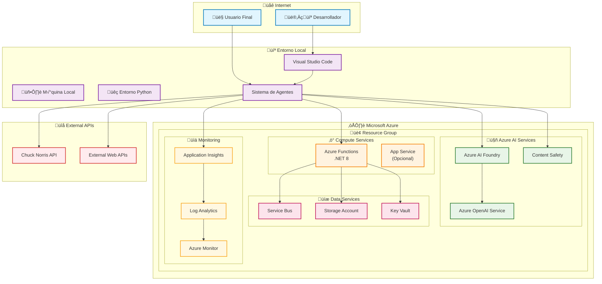
```mermaid
flowchart TB
    subgraph "üåê Internet"
        User[👤 Usuario Final]
        Developer[👨‍💻 Desarrollador]
    end
    
    subgraph "💻 Entorno Local"
        LocalEnv[🖥️ Máquina Local]
        PythonEnv[üêç Entorno Python]
        LocalApp[Sistema de Agentes]
        VSCode[Visual Studio Code]
    end
    
    subgraph "☁️ Microsoft Azure"
        subgraph "🏢 Resource Group"
            subgraph "🤖 Azure AI Services"
                AIFoundry[Azure AI Foundry]
                ContentSafety[Content Safety]
                OpenAIService[Azure OpenAI Service]
            end
            
            subgraph "‚ö° Compute Services"
                Functions["Azure Functions
                .NET 8"]
                AppService["App Service
                (Opcional)"]
            end
            
            subgraph "üíæ Data Services"
                ServiceBus[Service Bus]
                Storage[Storage Account]
                KeyVault[Key Vault]
            end
            
            subgraph "üìä Monitoring"
                AppInsights[Application Insights]
                LogAnalytics[Log Analytics]
                Monitor[Azure Monitor]
            end
        end
    end
    
    subgraph "üîå External APIs"
        ChuckAPI[Chuck Norris API]
        WebAPIs[External Web APIs]
    end
    
    User --> LocalApp
    Developer --> VSCode
    VSCode --> LocalApp
    
    LocalApp --> AIFoundry
    LocalApp --> ContentSafety
    LocalApp --> AppInsights
    LocalApp --> Functions
    
    AIFoundry --> OpenAIService
    Functions --> ServiceBus
    Functions --> Storage
    Functions --> KeyVault
    
    LocalApp --> ChuckAPI
    LocalApp --> WebAPIs
    
    AppInsights --> LogAnalytics
    LogAnalytics --> Monitor
    
    classDef user fill:#e1f5fe,stroke:#0277bd,stroke-width:2px
    classDef local fill:#f3e5f5,stroke:#7b1fa2,stroke-width:2px
    classDef azure fill:#e3f2fd,stroke:#1976d2,stroke-width:2px
    classDef ai fill:#e8f5e8,stroke:#2e7d32,stroke-width:2px
    classDef compute fill:#fff3e0,stroke:#f57c00,stroke-width:2px
    classDef data fill:#fce4ec,stroke:#c2185b,stroke-width:2px
    classDef monitoring fill:#fff8e1,stroke:#f9a825,stroke-width:2px
    classDef external fill:#ffebee,stroke:#d32f2f,stroke-width:2px
    
    class User,Developer user
    class LocalEnv,PythonEnv,LocalApp,VSCode local
    class AIFoundry,ContentSafety,OpenAIService ai
    class Functions,AppService compute
    class ServiceBus,Storage,KeyVault data
    class AppInsights,LogAnalytics,Monitor monitoring
    class ChuckAPI,WebAPIs external
```

### Diagrama de Componentes de Despliegue

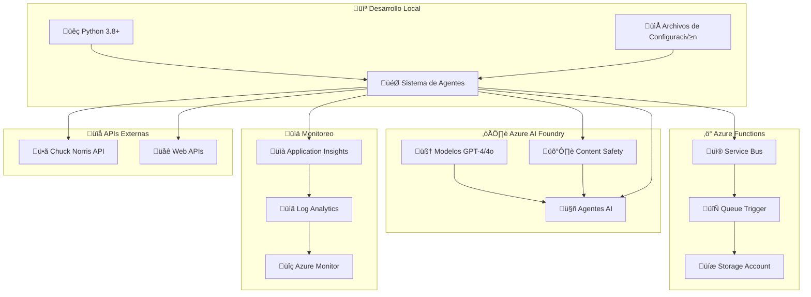
```mermaid
flowchart TB
    subgraph "💻 Desarrollo Local"
        Python[üêç Python 3.8+]
        App[🎯 Sistema de Agentes]
        Config[📁 Archivos de Configuración]
        
        Python --> App
        Config --> App
    end
    
    subgraph "☁️ Azure AI Foundry"
        Agents[🤖 Agentes AI]
        Models[🧠 Modelos GPT-4/4o]
        Safety[🛡️ Content Safety]
        
        Models --> Agents
        Safety --> Agents
    end
    
    subgraph "‚ö° Azure Functions"
        Trigger[🔄 Queue Trigger]
        Queue[üì® Service Bus]
        Storage[üíæ Storage Account]
        
        Queue --> Trigger
        Trigger --> Storage
    end
    
    subgraph "üìä Monitoreo"
        Insights[üìà Application Insights]
        Logs[üìã Log Analytics]
        Monitor[üîç Azure Monitor]
        
        Insights --> Logs
        Logs --> Monitor
    end
    
    subgraph "üîå APIs Externas"
        ChuckAPI[ü•ã Chuck Norris API]
        WebAPIs[üåê Web APIs]
    end
    
    App --> Agents
    App --> Safety
    App --> Insights
    App --> Queue
    App --> ChuckAPI
    App --> WebAPIs
```

## üöÄ Inicio R√°pido

### 1. Configuración del Entorno

```bash
# Clonar o descargar el proyecto
cd agente-aifoundry

# Activar entorno virtual Python (ya incluido)
source bin/activate  # macOS/Linux
# o
.\Scripts\activate   # Windows

# Instalar dependencias (ya instaladas en el entorno)
pip install -r requirements.txt
```

### 2. Configurar Variables de Entorno

Crea un archivo `.env` en la raíz del proyecto:

```bash
# Azure AI Foundry - REQUERIDO
PROJECT_ENDPOINT=https://tu-proyecto.cognitiveservices.azure.com/
MODEL_DEPLOYMENT_NAME=gpt-4

# Azure Content Safety - OPCIONAL (para moderación)
CONTENT_SAFETY_ENDPOINT=https://tu-content-safety.cognitiveservices.azure.com/

# Application Insights - OPCIONAL (para telemetría)
APPLICATION_INSIGHTS_CONNECTION_STRING=InstrumentationKey=xxx;IngestionEndpoint=https://xxx.in.applicationinsights.azure.com/

# Variables del sistema (se configuran autom√°ticamente)
AGENTS_DATA=[]  # Los agentes creados se guardan aquí
```

### 3. Autenticación con Azure

El sistema usa `DefaultAzureCredential`. Configura una opción:

**Opción 1 - Azure CLI (Recomendado para desarrollo):**
```bash
az login
```

**Opción 2 - Variables de entorno:**
```bash
export AZURE_CLIENT_ID="tu-client-id"
export AZURE_CLIENT_SECRET="tu-client-secret" 
export AZURE_TENANT_ID="tu-tenant-id"
```

**Opción 3 - Managed Identity (Para producción en Azure)**

### 4. Ejecutar el Sistema

```bash
python inicio.py
```

## 🎮 Cómo Usar el Sistema

### Men√∫ Principal

Al ejecutar `python inicio.py` ver√°s:

```
üöÄ SISTEMA DE AGENTES AZURE AI FOUNDRY
   Estado MCP: 🔴 INACTIVO

1. üîß Gestionar Agentes
2. 💬 Conversar con Agentes  
3. üöÄ Iniciar/Detener Servidor MCP
4. üìä Ver Estado del Sistema
5. ‚ùå Salir
```

### 1️⃣ Gestionar Agentes

- **Crear agentes**: Define nombre, tipo, instrucciones y herramientas
- **Actualizar agentes**: Modifica agentes existentes
- **Eliminar agentes**: Limpia agentes no deseados
- **Listar agentes**: Ve todos los agentes disponibles

### 2️⃣ Conversar con Agentes

- Selecciona un agente de la lista
- Inicia conversación natural
- El sistema incluye moderación de contenido automática
- Usa `salir`, `quit` o `exit` para terminar

### 3️⃣ Servidor MCP (Opcional)

- **Chuck Norris Facts**: Servidor MCP que provee datos de Chuck Norris
- Solo se inicia si lo seleccionas del men√∫
- Útil para testing y demostración del protocolo MCP

### 4️⃣ Estado del Sistema

- Ver estado del servidor MCP
- Lista de agentes disponibles
- Configuración de variables de entorno

## ‚ö° Azure Functions

El proyecto incluye una **Azure Function en .NET 8** (`funcion/`) con:

### Características
- **Queue Trigger**: Procesa mensajes de Azure Service Bus/Storage Queue
- **Framework**: .NET 8 (LTS)
- **Configuración**: `host.json`, `local.settings.json`

### Desarrollo Local
```bash
# Compilar la función
dotnet build funcion/

# Ejecutar localmente
func start --csharp --source-location funcion/bin/Debug/net8.0
```

### Despliegue
```bash
# Publicar a Azure
func azure functionapp publish tu-function-app --csharp
```

## 📁 Estructura del Proyecto

```
agente-aifoundry/
├── 📄 inicio.py                 # 🎯 Orquestador principal
├── 📄 crear_agente.py           # 🤖 Gestión de agentes
├── 📄 conversar_agente.py       # 💬 Sistema de conversación
├── 📄 chuck_norris_server.py    # 🔌 Servidor MCP opcional
├── 📄 conversar_function.py     # 🔗 Integración con Functions
├── 📄 requirements.txt          # 📦 Dependencias Python
├── 📄 mcp_config.json          # ⚙️ Configuración MCP
├── 📄 .env                     # 🔐 Variables de entorno (crear)
├── 📄 README.md                # 📖 Esta documentación
├── 📂 funcion/                 # ⚡ Azure Functions (.NET 8)
│   ├── funcion.csproj
│   ├── host.json
│   ├── local.settings.json
│   ├── Program.cs
│   └── QueueTrigger1.cs
├── 📂 bin/                     # 🐍 Entorno virtual Python
├── 📂 lib/                     # 📚 Librerías Python
└── 📂 __pycache__/            # 🗂️ Cache Python
```

## 🔧 Configuración Avanzada

### Tipos de Agentes Soportados

El sistema soporta m√∫ltiples tipos de agentes:

- **Conversacional**: Chat general y atención al cliente
- **Especialista**: Dominio específico (finanzas, salud, etc.)
- **Orquestador**: Coordina m√∫ltiples agentes
- **Asistente**: Tareas específicas y automatización

### Herramientas para Agentes

Los agentes pueden usar herramientas como:

- **Búsqueda web**: Información en tiempo real
- **APIs externas**: Integración con servicios
- **Bases de datos**: Consultas y actualizaciones
- **Funciones personalizadas**: Lógica específica

### Moderación de Contenido

Configuración automática de Azure Content Safety:

```python
# Umbrales de moderación (0-7)
HATE_THRESHOLD = 4      # Contenido de odio
VIOLENCE_THRESHOLD = 4  # Violencia
SEXUAL_THRESHOLD = 4    # Contenido sexual
SELF_HARM_THRESHOLD = 4 # Autolesiones
```

## 🛠️ Desarrollo y Personalización

### Agregar Nuevos Agentes

1. Ejecuta `python crear_agente.py`
2. Selecciona "Crear nuevo agente"
3. Define las características:
   - Nombre √∫nico
   - Tipo de agente
   - Instrucciones detalladas
   - Herramientas necesarias

### Personalizar el Sistema

**Modificar inicio.py:**
- Agregar nuevas opciones al men√∫
- Cambiar validaciones del entorno
- Personalizar mensajes del sistema

**Extender crear_agente.py:**
- Nuevos tipos de agente
- Herramientas personalizadas
- Integraciones adicionales

**Mejorar conversar_agente.py:**
- Nuevos comandos de chat
- Filtros de moderación personalizados
- Exportación de conversaciones

## 🐛 Solución de Problemas

### ‚ùå Error: Variables de entorno faltantes

```bash
‚ùå Variables de entorno faltantes:
   - PROJECT_ENDPOINT
   - MODEL_DEPLOYMENT_NAME
```

**Solución:** Configura tu archivo `.env` con los valores correctos de Azure AI Foundry.

### ❌ Error: Autenticación falló

```bash
❌ Error de autenticación con Azure
```

**Solución:** 
1. Ejecuta `az login`
2. Verifica permisos en Azure AI Foundry
3. Confirma que las credenciales tienen acceso al recurso

### ‚ùå Error: No se pueden crear agentes

```bash
‚ùå No se pudo crear el agente
```

**Solución:**
1. Verifica que `MODEL_DEPLOYMENT_NAME` sea correcto
2. Confirma que el modelo est√° desplegado y disponible
3. Revisa logs en Azure Portal

### ‚ùå Error: Servidor MCP no inicia

```bash
‚ùå Error al iniciar servidor MCP
```

**Solución:**
1. Verifica que `chuck_norris_server.py` existe
2. Confirma que el puerto no esté en uso
3. Revisa las dependencias de MCP

## üìä Monitoreo y Observabilidad

### Telemetría Incluida

- **Azure Application Insights**: Métricas de rendimiento
- **OpenTelemetry**: Trazas distribuidas
- **Logs estructurados**: Para debugging
- **Métricas de moderación**: Seguridad de contenido

### Dashboards Disponibles

Si configuras Application Insights:
- Tiempo de respuesta de agentes
- Volumen de conversaciones
- Eventos de moderación
- Errores y excepciones

## üîê Seguridad

### Mejores Pr√°cticas Implementadas

- ✅ **Managed Identity**: Autenticación sin credenciales
- ✅ **Content Safety**: Moderación automática
- ‚úÖ **Logs auditables**: Trazabilidad completa
- ‚úÖ **Variables de entorno**: Sin credenciales hardcoded
- ‚úÖ **HTTPS**: Conexiones seguras a APIs
- ✅ **Validación de entrada**: Sanitización de datos

## 🤝 Contribución

1. Fork el proyecto
2. Crea una rama feature (`git checkout -b feature/nueva-funcionalidad`)
3. Commit tus cambios (`git commit -am 'Agregar nueva funcionalidad'`)
4. Push a la rama (`git push origin feature/nueva-funcionalidad`)
5. Abre un Pull Request

## 📄 Licencia

Este proyecto est√° bajo la Licencia MIT. Ver `LICENSE` para m√°s detalles.

## 🆘 Soporte

- **Documentación**: Este README
- **Issues**: Reporta problemas en GitHub
- **Azure Docs**: [Azure AI Foundry Documentation](https://docs.microsoft.com/azure/ai-foundry/)
- **MCP Protocol**: [Model Context Protocol Specification](https://modelcontextprotocol.io/)

## 🏷️ Tags

`azure-ai` `azure-foundry` `python` `chatbot` `mcp` `azure-functions` `dotnet` `conversational-ai` `content-moderation` `opentelemetry`

---

**üéâ ¬°Listo para crear agentes inteligentes con Azure AI Foundry!**

## ⚠️ Limitaciones y Consideraciones Técnicas

### üö® Limitaciones Importantes de Azure AI Foundry

Antes de implementar en producción, ten en cuenta estas limitaciones actuales:

#### **üîß Herramientas y Extensiones**

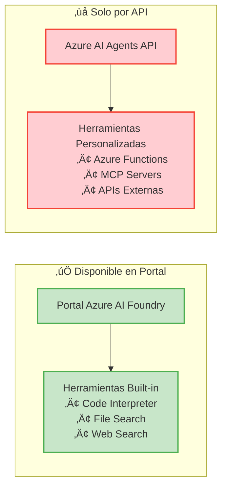
```mermaid
flowchart LR
    subgraph "‚úÖ Disponible en Portal"
        Portal[Portal Azure AI Foundry]
        BuiltIn["Herramientas Built-in
        • Code Interpreter
        • File Search
        • Web Search"]
    end
    
    subgraph "‚ùå Solo por API"
        API[Azure AI Agents API]
        Custom["Herramientas Personalizadas
        • Azure Functions
        • MCP Servers
        • APIs Externas"]
    end
    
    Portal --> BuiltIn
    API --> Custom
    
    classDef availableNode fill:#c8e6c9,stroke:#4caf50,stroke-width:2px
    classDef apiOnlyNode fill:#ffcdd2,stroke:#f44336,stroke-width:2px
    
    class Portal,BuiltIn availableNode
    class API,Custom apiOnlyNode
```

**üö´ Azure Functions y MCP no aparecen en el portal:**
- Las herramientas personalizadas como Azure Functions y servidores MCP **NO** se pueden configurar desde la interfaz web de Azure AI Foundry
- **Solución**: Deben configurarse programáticamente usando la API de Azure AI Agents
- **Impacto**: Mayor complejidad de configuración y debugging

#### **üåç Disponibilidad Regional del MCP**

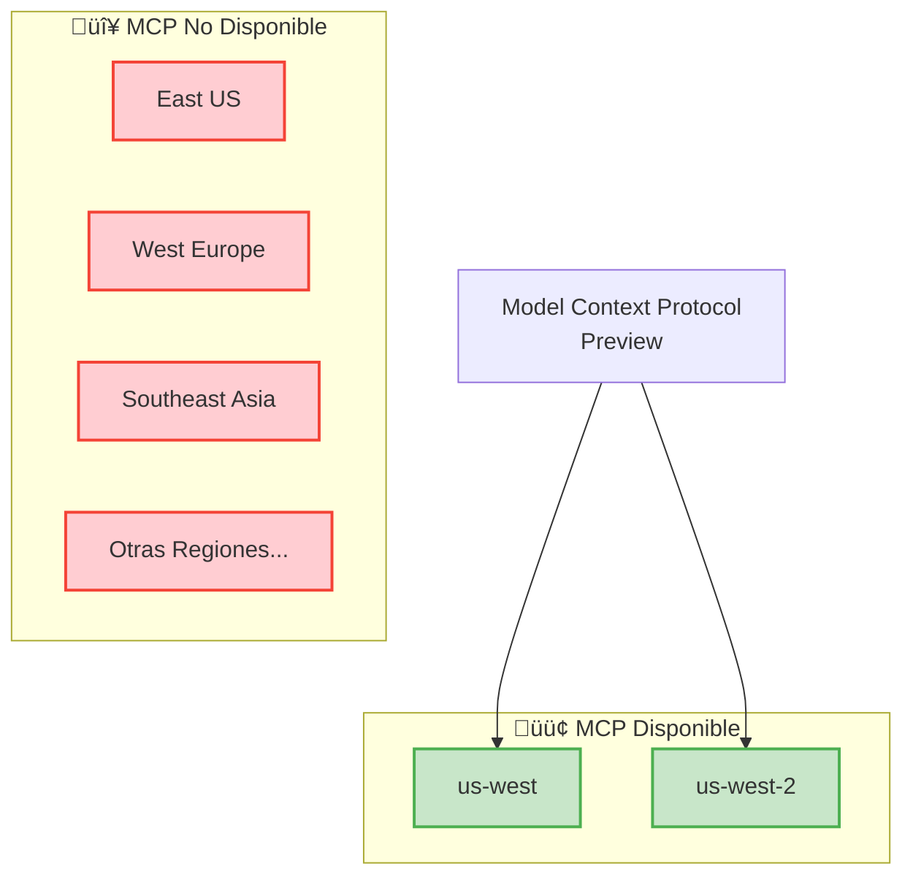
```mermaid
flowchart TB
    subgraph "🟢 MCP Disponible"
        USW1[us-west]
        USW2[us-west-2]
    end
    
    subgraph "🔴 MCP No Disponible"
        EUS[East US]
        WEU[West Europe]
        SEA[Southeast Asia]
        Others[Otras Regiones...]
    end
    
    MCP["Model Context Protocol
    Preview"] --> USW1
    MCP --> USW2
    
    classDef availableNode fill:#c8e6c9,stroke:#4caf50,stroke-width:2px
    classDef unavailableNode fill:#ffcdd2,stroke:#f44336,stroke-width:2px
    
    class USW1,USW2 availableNode
    class EUS,WEU,SEA,Others unavailableNode
```

**⚠️ MCP está en Preview limitado:**
- **Solo disponible** en regiones `us-west` y `us-west-2`
- **Estado**: Preview (puede cambiar sin previo aviso)
- **Fecha de commit**: Junio 2025
- **Recomendación**: Verificar disponibilidad regional antes del despliegue

#### **🔗 Orquestación Agent-to-Agent**

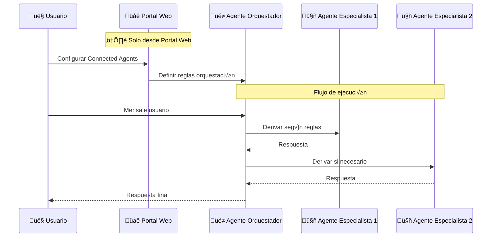
```mermaid
sequenceDiagram
    participant U as 👤 Usuario
    participant W as üåê Portal Web
    participant O as üé≠ Agente Orquestador
    participant A1 as 🤖 Agente Especialista 1
    participant A2 as 🤖 Agente Especialista 2
    
    Note over W: ⚠️ Solo desde Portal Web
    U->>W: Configurar Connected Agents
    W->>O: Definir reglas orquestación
    
    Note over O,A2: Flujo de ejecución
    U->>O: Mensaje usuario
    O->>A1: Derivar seg√∫n reglas
    A1-->>O: Respuesta
    O->>A2: Derivar si necesario
    A2-->>O: Respuesta
    O-->>U: Respuesta final
```

**üö´ Connected Agents solo desde la web:**
- La orquestación **Agent-to-Agent** (Connected Agents) **NO** se puede configurar por API
- **Limitación**: Solo disponible desde la interfaz web de Azure AI Foundry
- **Workaround**: Implementar lógica de orquestación personalizada en el código cliente

#### **üìù Paso de Variables y Contexto**

**‚ùå Lo que NO funciona:**
```python
# ‚ùå ESTO NO FUNCIONA - No hay paso directo de variables
agente_orquestador.send_variable("customer_id", "88129215")
agente_ejecutor.receive_variable("customer_id")  # No disponible
```

**✅ Lo que SÍ funciona:**
```python
# ✅ ESTO SÍ FUNCIONA - Contexto conversacional
content = f"[CONTEXT: customer_id={metadata_usuario['customer_id']}] {entrada_usuario}"

mensaje = cliente_agentes.messages.create(
    thread_id=hilo.id, 
    role="user", 
    content=content  # Contexto embebido en el mensaje
)
```

**🔄 Patrón de Contexto Conversacional:**
- **No hay** paso nativo de variables entre UX ‚Üí Orquestador ‚Üí Agente Ejecutor
- **Solución**: Embeber contexto en el contenido del mensaje
- **Formato recomendado**: `[CONTEXT: key=value, key2=value2] mensaje_usuario`

### 🛠️ Workarounds y Alternativas

#### **Para Herramientas Personalizadas:**

```python
# Configuración programática de herramientas
herramientas_personalizadas = [
    {
        "type": "function",
        "function": {
            "name": "consultar_azure_function",
            "description": "Consulta una Azure Function para procesamiento",
            "parameters": {
                "type": "object",
                "properties": {
                    "query": {"type": "string"},
                    "customer_id": {"type": "string"}
                }
            }
        }
    }
]

# Crear agente con herramientas por API
agente = cliente_agentes.agents.create(
    model=MODEL_DEPLOYMENT_NAME,
    name="Agente con Functions",
    instructions="Usa Azure Functions cuando sea necesario",
    tools=herramientas_personalizadas  # ⚠️ Solo por API
)
```

#### **Para Orquestación Personalizada:**

```python
def orquestador_personalizado(mensaje_usuario, customer_id):
    """
    Implementa lógica de orquestación personalizada
    como alternativa a Connected Agents
    """
    contexto = f"[CONTEXT: customer_id={customer_id}]"
    
    # Lógica de decisión
    if "consulta_general" in mensaje_usuario.lower():
        return agente_conversacional.process(f"{contexto} {mensaje_usuario}")
    elif "problema_tecnico" in mensaje_usuario.lower():
        return agente_soporte.process(f"{contexto} {mensaje_usuario}")
    else:
        return agente_especialista.process(f"{contexto} {mensaje_usuario}")
```

### üìã Checklist de Limitaciones

Antes de desplegar en producción, verifica:

- [ ] **Región**: ¿Tu región soporta todas las funcionalidades necesarias?
- [ ] **MCP**: ¬øNecesitas MCP? ‚Üí Usar solo us-west/us-west-2
- [ ] **Herramientas**: ¬øHerramientas personalizadas? ‚Üí Configurar por API
- [ ] **Orquestación**: ¿Multiple agentes? → Portal web o lógica personalizada
- [ ] **Variables**: ¿Contexto entre agentes? → Usar patrón conversacional
- [ ] **Fallbacks**: ¬øAlternativas si falla una funcionalidad?

### 🔮 Roadmap y Evolución

**Se espera que Azure AI Foundry evolucione:**
- Soporte API para Connected Agents
- Expansión regional de MCP
- Herramientas personalizadas en portal
- Paso nativo de variables

**Mantente actualizado:**
- [Azure AI Foundry Updates](https://docs.microsoft.com/azure/ai-foundry/whats-new)
- [Azure Roadmap](https://azure.microsoft.com/roadmap/)

